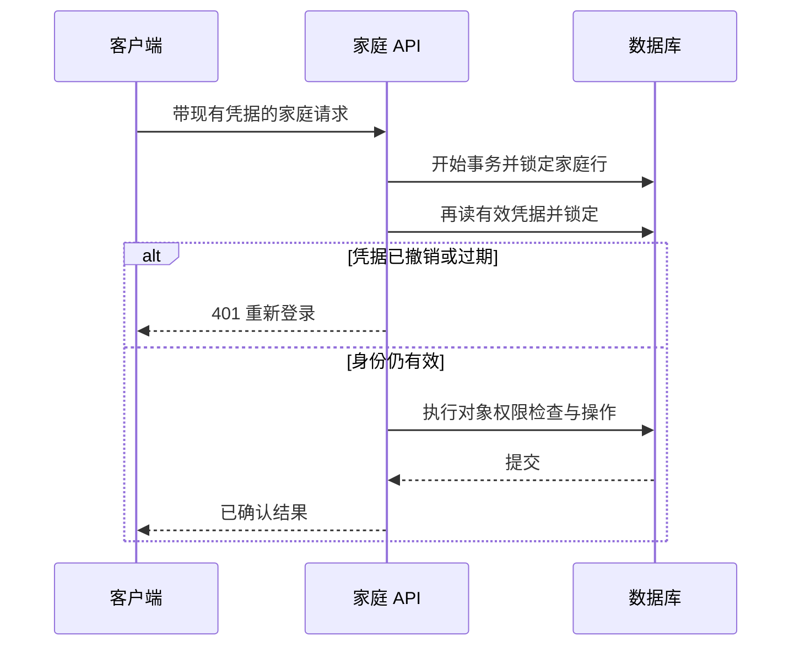

# 家庭账号与登录管理

v0.20 本地实现，2026-10-01。家长现在可以查看有效登录数量、修改密码和退出家庭的全部登录。两端共用结果状态与中英文文案；服务在执行家庭操作时重新核验凭据，避免仅在请求入口通过验证的旧身份继续写入。此功能仍使用本地家庭账号，不等于全球身份、密码找回或监护验证已经完成。

## v0.23 成员规则

现已接通家庭内独立家长账号：创建者管理自己的密码和全家庭登录；协作家长管理自己的密码及其签发的登录。每位成员的失败计数独立。响应新增 `memberRole`，界面按角色说明影响范围，详情见 [家长协作](FAMILY-MEMBERS.md)。下面的 schema 18 和 v0.20 证据记录原交付；当前部署要求 schema 26，按 [数据库交接](POSTGRESQL.md) 执行。

## 1. 家长体验

Web 从「家庭空间 → 账号与登录」进入；原生家长空间提供同名入口。孩子模式不能打开账号管理。

| 操作 | 输入与确认 | 成功后的结果 |
|---|---|---|
| 查看登录 | 有效家长身份 | 按家长/孩子、浏览器/App 分组统计；不返回令牌、IP 或设备指纹 |
| 修改家长密码 | 当前密码、新密码、重复新密码、确认影响范围 | 更新密码并撤销该家庭全部登录，包括当前页面 |
| 退出全部登录 | 当前密码、确认影响范围 | 撤销该家庭全部登录，密码不变 |

登录数不代表设备数，同一个设备可能有多个有效凭据。数值是打开页面时的快照，不是实时在线人数。取消不提交；提交中防重复点击，输入值在开始提交时从表单状态清空，不写入日志或持久化客户端状态。

操作前明确说明：所有浏览器、App 和孩子模式都需重新登录，家庭记录保留，离线设备要在联网后才得知撤销。接口失败有两种反馈：密码错误、限流或输入不合规则允许修正；网络中断、未知响应或结果无法确认则回到重新登录流程，不显示假成功。如果刚尝试修改密码，提示先用新密码登录。

Web 在请求层通知当前页面和同来源标签页，即使账号卡片已卸载也结束旧页面身份。原生清理内存身份、已存凭据和续练准备；晚到结果不能清除之后建立的新登录。其他物理设备在下次联网操作时获知凭据已失效，不承诺即时远程擦除。

## 2. 密码和尝试限制

新建账号和新密码最少 15 个 Unicode 码点；接受长句、空格和 Unicode，不自动去空格，不要求拼凑大小写/数字/符号。输入上限为 128 个 UTF-16 单元，因此含补充字符时可用码点数少于 128。既有密码仍按原值验证，不要求旧家庭先改密码才能登录。

敏感操作验证当前密码、支持长密码以及限制失败尝试，参考 [OWASP 身份验证指南](https://cheatsheetseries.owasp.org/cheatsheets/Authentication_Cheat_Sheet.html)。本地实现继续使用原加盐 scrypt 格式；这不是对生产密码体系完整性的声明。

登录和账号操作共用数据库中的失败次数：连续 8 次错误后限制 15 分钟，验证成功清零，冷却结束后的首次错误重新计数。错误计数必须先提交，再向客户端返回拒绝，进程重启不会重置。普通登录维持统一 `LOGIN_FAILED`，不区分未知家庭、错误密码或冷却；已登录家长操作可返回 `ACCOUNT_LOCKED`。

8 次/15 分钟是开发配置，尚无实际滥用流量依据。生产还需要账户与网络维度速率限制、泄露密码检查、密码哈希成本评估、找回与通知、监控和避免恶意锁定家庭的策略。

## 3. 执行身份和事务

业务方法通过统一包装进入家庭事务，再核对数据库中最新的 family、scope、child、transport、device 和到期时间。读取也使用此边界；撤销之后才取得家庭锁的旧读取和旧写入均被拒绝。已经提交的操作不能被之后的退出倒回，已传出的响应也不能远程收回。

`transactionScope` 用 AsyncLocalStorage 让内部帮助方法加入外层同一事务和连接，不开启嵌套事务或保存点。锁顺序为家庭 → 登录 → 孩子/练习。登录也锁定家庭行，因此旧密码登录、孩子身份切换和修改密码按同一家庭次序处理。密码更新与全部凭据删除同事务，任一步失败整体回滚。

这会串行化同一家庭的请求，不同家庭可并发。较大导出和复杂报告会延长家庭锁持有时间；当前未完成容量测试，不能由并发正确性测试推导吞吐量。生产优化必须保留撤销检查与写入之间的一致边界。

退出只撤销身份凭据，保留孩子档案、已保存记录、活动练习和原签名续练授权。授权不提供远程即时撤销：离线客户端可能在原期限内继续运行，旧凭据重连读写会被拒绝；经家长重新登录可在原有效期内恢复记录，不延长练习或补传期限。撤销服务端会话的原则参见 [OWASP 会话管理指南](https://cheatsheetseries.owasp.org/cheatsheets/Session_Management_Cheat_Sheet.html)。

## 4. 接口和数据

| 接口 | 契约 |
|---|---|
| `GET /api/account/security` | 家长作用域；`version=account-security-1`、familyId、passwordChangedAt、active.parent/child.web/native；no-store |
| `POST /api/auth/change-password` | 严格对象 `{currentPassword,newPassword,acknowledged:true}`；新旧密码不能相同 |
| `POST /api/auth/logout-all` | 严格对象 `{currentPassword,acknowledged:true}` |
| 两项成功响应 | `{ok:true,signInRequired:true}`；Web 清除当前 Cookie，原生不设置 Cookie |

Web 继续要求来源与 CSRF；原生继续要求绑定传输的 Bearer 凭据。错误包含 `UNAUTHENTICATED`、`PARENT_REQUIRED`、`PASSWORD_REJECTED`、`PASSWORD_UNCHANGED`、`ACCOUNT_LOCKED`、`INVALID_REQUEST`。客户端忽略已经离开的页面的晚到数据，并拒绝家庭 ID 或契约版本不匹配的快照。

迁移 18 增加 families.password_changed_at、auth_failures、auth_locked_until，以及 auth_sessions(family_id,expires_at) 索引。独立 PostgreSQL 运行角色只获迁移表 SELECT，用于启动时确认恰为 schema 18；缺少授权、旧版或未知新版都拒绝启动，角色无权修改迁移表。

## 5. 升级和回退

1. 停止连接同一数据库的**全部旧版家庭 API**，包括旧实例和后台开发服务；备份数据库及对应签名目录。旧 API 未包含本轮执行身份检查，不能混用新旧实例宣称撤销已可靠生效。
2. 独立 PostgreSQL 用迁移身份运行 `npm run db:prepare`，确认 schema 18，然后移除迁移连接，使用受限家庭/工作台角色启动 v0.20。PGlite 开发模式在新服务启动时自动迁移。
3. 在虚构账号验收当前密码、旧凭据拒绝、再次登录、孩子档案保留、重启持久化，再开放开发访问。详见 [数据库运行交接](POSTGRESQL.md)。
4. 若失败，保持服务关闭，恢复配套的数据库、签名目录和已知代码；不能删除迁移版本行冒充回退，不能恢复已经宣称撤销的旧凭据后继续开放访问。

## 6. 验收和发布缺口

[本轮证据](qa/account-security-v0.20.md) 包含业务/客户端、HTTP、真实 PostgreSQL、构建及浏览器检查。中文和英文桌面界面已检查；浏览器已完成虚构家庭的跨页退出与重新登录。

v0.20 当时的浏览器工具只完成空表单、焦点、禁用与取消检查；密码更改的事务和接口通过自动测试。当时的手机视口设置也未生效，不能记为窄屏通过。2026-10-07 已使用隔离浏览器补上[真实密码提交流程](qa/account-password-browser-2026-10-07.md)：320 像素表单、跨标签页清屏、旧密码拒绝、新密码登录和档案保留均通过。原生新页面的实际设备界面和加密存储清理仍待验收。

正式 OIDC、找回、MFA、可验证监护同意、逐台登录撤销、账号安全通知、跨地区权利与生产运维均未由此交付完成。全产品仍按 [执行计划](DELIVERY-PLAN.md) 的门槛推进，生产开关保持关闭。
