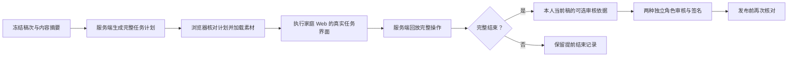

# 候选内容试玩与审核证据

版本：平台 v0.15.0 · 2026-09-30。面向内部内容团队，产品服务对象仍为全球家庭。此能力帮助审核人员核对实际交互，不构成适龄批准或效果研究。

## 1. 解决的问题与操作路径

仅阅读文案和素材不能确认孩子实际看到的顺序、提示、时间窗、帮助与暂停行为。工作台现在可以执行冻结稿的完整任务，审核决定绑定这次试玩和当前稿次。v0.15 可先从 [素材库](MEDIA-LIBRARY.md) 导入 PNG/MP3 并换稿；试玩读取冻结稿绑定的交付文件。

1. 编辑保存并冻结一稿。四种工作台身份都可进入该稿的试玩。
2. 选择难度 1–3、实际输入方式和题目种子。任务、年龄和语言来自冻结稿，不能在试玩时另换内容。
3. 点击“准备并进入候选试玩”，完成原有示范和全部正式步骤。时间窗、反馈和暂停方式与家庭 Web 相同；不提供加速或跳题。
4. 结束后等待“试玩已核对”，返回当前稿。完整结束、提前结束和尚未核对分别显示。
5. 方法审核、语言与适龄审核各自选择本人当前稿的完整试玩记录，再填写检查项和审核依据。退回修改不要求完成试玩。
6. 发布时重新检查两名审核人的试玩关联、身份和签名。编辑撤回、退回修订或召回使旧稿试玩失去本轮使用资格。

**至少一次完整试玩只是工作流门槛。** 不表示已覆盖全部难度、输入方式、设备、文化适用性或异常分支。真实审核仍需要专业人员按内容验收矩阵开展，不能由软件自动批准。

## 2. 复用边界

| 模块 | 职责 |
|---|---|
| `apps/api/studio-preview.ts` | 当前身份、冻结稿、资产核验；生成和保存计划；回放操作并形成回执 |
| `packages/content/preview.ts` | 候选快照、试玩回执类型 |
| `packages/content/preview-client.ts` | 核对内容摘要、完整计划、任务作用域；重新生成计划并逐项比对 |
| `apps/content-admin/src/preview.tsx` | 受保护独立页面、素材解码、审核身份变化处理、试玩保存端口 |
| `apps/family-web/src/Play.tsx` | 两种入口共用的任务呈现、输入、帮助、暂停、反馈和结束界面 |
| `apps/api/content-studio.ts` | 通过与发布都要求当前稿的本人完整试玩；签署关联证据 |

试玩从独立工作台来源加载，不创建家庭、儿童、家庭会话或周报告，不消耗家庭练习额度，也不调整课程和难度。共享 `Play` 组件通过 `StaffPreviewPort` 替换准备、状态检查、保存与结束确认；正常家庭入口继续使用原有离线日志、签名续练授权和家庭接口。

**目前是 Web 渲染器试玩。** 两端共享引擎不代表原生界面已被此工具验证；React Native 的手势、音频、后台行为、真实计时和无障碍仍须在设备上验收。

## 3. 冻结与核验协议

开始时服务端保存不可变的候选包、`packHash`、完整 `plan`、`planHash`、`round`、创建身份、种子、输入环境和 30 分钟截止时间。开始请求使用 UUID 幂等键和稿件 `If-Match`；同一页对相同未确认请求重试复用幂等键，刷新后不保留该重试键。

浏览器依次检查：

- 内容包严格结构和 SHA-256；计划绑定相同任务、年龄、语言、版本、预算和内容引用。
- 完整计划摘要，并用共享引擎按相同条件重新生成计划后比较。只重算攻击者改动计划的摘要，不能通过后一检查。
- 每个图像或音频文件的字节长度与摘要；图像解码成功后才进入任务。通过 `blob:` 地址呈现，退出时回收。

这里传递的是经认证读取的**未发布候选快照**，不是已批准的发布清单。候选包使用预期发布的审核标记以保持最终签署摘要稳定；这个标记本身不代表真实批准，也不赋予家庭端使用资格。

结束请求提交有序事件。服务端使用原引擎及预算回放，只有合法结束才能获得回执，且仅 `endReason=completed` 可满足审核门槛。回执包含事件摘要、完成状态、正式步骤、独立步骤、技术排除、中断和任务有效时长。相同事件重试返回原回执；不同事件不能替换已核对记录。

审核签名的依据字段包含人工说明、试玩编号、计划摘要和事件摘要。数据库另保存审核到试玩的外键；工作台显示编号，便于追溯。旧稿、其他身份、提前结束或未核对的记录均不可借用。审核人停用与原有签名校验规则继续生效。

这些检查证明操作符合协议与当前记录关联，**不证明真人确实操作、物理响应时间准确或孩子能够受益**。本地管理员仍能修改数据库；防篡改审计与人员管理属于生产建设范围。

## 4. 生命周期与恢复

- 未完成试玩窗口为服务端创建后 30 分钟。页面同时按墙钟与单调时钟前进检查；服务端最终检查截止时间。此处没有可信硬件计时。
- 已核对完整记录可在当前稿仍有效时用于审核，不因试玩窗口结束而消失。截止时间限制新操作，不把历史证据删掉。
- 当前页操作仅保存在内存，不使用家庭 IndexedDB、Service Worker 或离线恢复。刷新或关闭页面会丢失尚未核对的操作；工作台仍显示未核对记录，可重新准备一份试玩。
- 核对失败时保持页面并重试；正常完成按钮在回执确认前不可返回。顶部保留明确标为“放弃未核对操作”的退出入口。
- 身份广播使当前页面立即停止并卸载播放器。远端停用、退回、召回或连接问题通过状态检查停止试玩；无法承诺网络断开时即时接收远端变更。
- 当前稿被编辑撤回后进入新稿次。即使文本没有变化、摘要相同，也不能复用前一稿的批准与试玩。

## 5. 数据迁移与接口

迁移 13 新增 `studio_previews`，并给 `studio_reviews` 增加可空外键 `preview_id`。历史记录不重写；旧批准没有这项证据时不能用于新发布，作者需“撤回本稿并重新编辑”，重新提交、试玩和双审。已发布的历史版本不会仅因部署此迁移被自动召回；需要团队另行评估。

`studio_previews` 保存身份/稿次/包摘要、候选包与完整计划、计划摘要、预算、时间窗、开始请求幂等信息、结束事件及回执。写入和读取当前状态遵循现有工作台事务锁顺序。尚无归档、分页或保留期限清理任务。

接口前缀为独立来源的 `/api/studio`：

| 方法与路径 | 主要字段与规则 |
|---|---|
| `POST /drafts/:id/preview` | `confirmHash,level,seed,environment`；`Idempotency-Key` 和 `If-Match`；仅 `web` 环境 |
| `GET /previews/:id` | 仅创建身份读取当前有效稿的快照；已结束返回回执 |
| `POST /previews/:id/finish` | `{events}`；按事件摘要幂等，不要求另一命令键；最多 1000 事件且仍受 64 KB 正文上限约束 |
| `POST /drafts/:id/reopen` | 作者提交 20–700 字符原因；递增稿次，原审核保留历史 |
| `POST /drafts/:id/review` | 通过时追加 `previewId`；退回可省略 |
| `GET /drafts/:id` | 包含最近 100 次试玩，页面显示最近 12 次；选择器列出返回范围内可用记录；审核显示 `preview_id` |

关键错误：`STUDIO_PREVIEW_REQUIRED` 缺少适用记录；`STUDIO_PREVIEW_STALE` 稿次失效；`STUDIO_PREVIEW_EXPIRED` 未结束试玩过期；`STUDIO_PREVIEW_UNFINISHED` 操作未结束；`STUDIO_PREVIEW_CONFLICT` 尝试替换结束记录；`STUDIO_PREVIEW_EVENTS_INVALID` 事件违反协议。

所有接口沿用身份、CSRF、来源检查及请求体上限。页面路径为 `/preview/:id`；候选页面 CSP 允许经核验素材的 `blob:` 图片/音频和共享渲染器的内联样式，脚本仍限同来源，拒绝 iframe 嵌入。工作台不注册离线 Service Worker。

## 6. 验收范围与后续

v0.14 批次 183 项自动检查和 6 项真实 HTTP 检查通过。候选协议测试覆盖 32 个任务/年龄/语言组合 × 3 个难度，即 96 份完整计划；这使用合成事件，不是 96 次真实浏览器或儿童测试。

内置浏览器完成中文 6–8 岁搜索、英文 15–17 岁记忆的完整流程；另检查中文限时抑制任务的规则音频控制、理解检查、暂停重做与提前结束，以及英语监测任务的目标响应和跨页面身份停止。完整细节、构建摘要和截图见 [本批验收](qa/candidate-preview-v0.14.md)。

后续交付仍包含：跨浏览器与原生设备矩阵、完整试听及母语审核、更多异常分支与内容参数审阅、完整素材制作及生产处理隔离、企业身份、生产签名与审计、分页及保留期限。所有 32 份源内容仍未真实专业批准；商业发布与效果验证仍按完整产品方案执行。

当前 v0.15 素材导入后的搜索完整试玩与文件发布/召回验证见 [素材库验收](qa/media-library-v0.15.md)；190 项自动检查、6 项真实 HTTP 检查通过。
