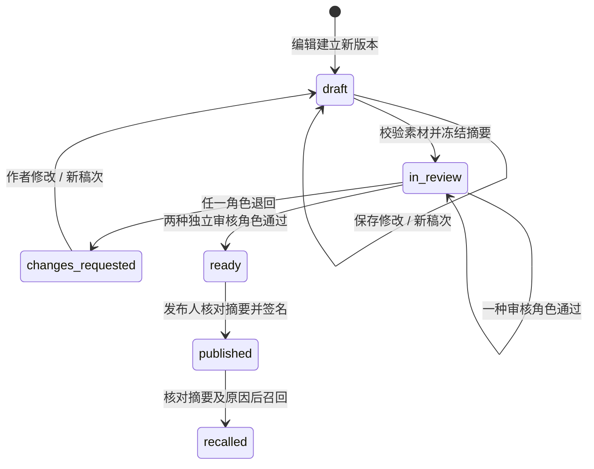

# 内容工作台：编辑、独立双审与本地发布

版本：平台 v0.31.0 · 2026-10-01。适用对象是产品团队的编辑、方法负责人、本地化审核与发布管理人员。家庭仍是产品服务对象，这个内部工具不改变全球家庭定位。

工作台 v0.24 新增“家长课与生活任务”独立队列，按年龄管理九课与四个双语模板，采用方法、中文、英文三项独立审阅。下文原任务双审流程继续有效；新增家庭内容的操作、接口和召回规则见 [专门交接](FAMILY-CONTENT.md)。

## 1. 本批解决的问题

之前只能验证一份已经签名的内容包，团队没有真实的编辑、退回、审阅和发布入口。现在可从既有内容建立独立草稿，查看文案差异和图像、试听固定语音，经过两种独立审核角色后发布本地预览，并在必要时召回。v0.14 新增冻结候选的完整任务试玩；通过与发布都需要本人当前稿的完整试玩关联，详见 [候选试玩设计](CANDIDATE-PREVIEW.md)。

v0.15 进一步接通 [图片与固定语音素材库](MEDIA-LIBRARY.md)，支持文件导入、技术检查、来源声明和换稿。

v0.31 要求两类审核人分别在当前稿页面完整试听已配置的每份声音。工作台在播放器从头播放到结束且未快进时记录该文件摘要；批准请求须提交全部且仅有当前声音摘要。服务端把摘要清单写入审核记录，并把清单摘要纳入签名依据。发布前再次核对两位审核人的文件清单；旧式仅勾选“素材已检查”的批准不能直接发布，须由作者开启新稿次重新审核。完整播放事件是操作证据，不能证明真人确实听懂或音质合格；审核人仍须亲自判断并写明依据。

**现有 32 份源内容仍是未审核开发材料。** 自动测试与浏览器验收只在独立测试库里使用虚构角色；它们不能证明已通过真实专业审稿。本工作台的 `reviewed-preview` 只允许 `LOCAL` 市场与本地运行模式，生产校验拒绝该通道。

## 2. 运行与身份准备

```sh
npm run build
npm start
```

默认家庭服务位于 `http://127.0.0.1:4181/`，工作台位于 `http://127.0.0.1:4184/`。工作台独立构建到 `dist/studio/`，也可单独执行 `npm run studio:build`。开发模式下修改工作台前端后须重新构建并刷新；它没有独立热更新服务。

`API_PORT` 修改家庭端口，`STUDIO_PORT` 默认是家庭端口加 3；设为 `0` 可关闭工作台监听。两个服务都只绑定 `127.0.0.1`。这是本地配置，不能直接搬到公网；当前 `APP_MODE=production` 拒绝启动。

### 本地团队账号

没有默认管理账号，也没有家庭账号升级管理权限的接口。由本机操作人员为四种职责分别创建身份：

| 角色值 | 可执行的操作 |
|---|---|
| `editor` | 从既有内容建稿；修改自己未冻结或被退回的稿件；导入/换用素材；提交 |
| `method-reviewer` | 对冻结稿提交方法审核依据，通过或退回 |
| `language-reviewer` | 对同一冻结稿提交语言与适龄审核依据，通过或退回 |
| `publisher` | 双审齐全后发布本地预览；召回及重试清理 |

四种角色均可查看内容与审核记录。角色在本地创建后不可通过 HTTP 更改。不同账号不自动证明不同自然人，实际任职和利益冲突仍由团队管理。

1. 使用 PGlite 时先停止占用该数据目录的 API。不要从第二个进程并发打开同一个 PGlite 目录。
2. 在受控、仅属主可读写的私有 JSON 文件中填写 `login`、`name`、`role`、`password`。账号为 3–64 个小写字母、数字、点、下划线或连字符，以字母或数字开头；密码为 12–128 个字符。不要将此文件提交到代码库。
3. 运行以下命令，两个路径替换成操作人员的私有文件。输出文件须尚不存在。

```sh
node scripts/studio-identity.ts provision /private/path/input.json /private/path/enrollment.json
```

4. 将输出的 `authenticatorSecret` 私密交给对应人员，录入其验证器：TOTP、SHA-1、6 位、30 秒。配置资料和密码按团队凭据管理流程保存；不要贴到聊天、日志或内容材料中。
5. 重新启动服务，人员使用账号、密码及新的一轮动态验证码登录。

自定义数据目录时，命令与 API 必须使用同一 `FOCUS_DATA_DIR`；独立 PostgreSQL 须先完成 [显式初始化](POSTGRESQL.md)，身份命令与工作台使用同一受限 `FOCUS_STUDIO_DATABASE_URL`，不能复用家庭 `DATABASE_URL`。停用账号同样通过本地操作命令，PGlite 使用前仍须停服：

```sh
node scripts/studio-identity.ts disable editor.login
```

停用会撤销该身份全部管理会话。已停用审核人的批准不能用于新的发布；已发布内容不会因停用自动召回，疑似凭据泄露须由发布管理人员另行召回相关版本。目前还没有密码重置、验证器恢复、密钥轮换或作者工作交接界面。

### 隔离验收账号

`scripts/seed-studio-qa.ts <private-output.json>` 总是创建新的临时数据库和四个虚构角色，输出私有测试清单。它不向主家庭库插入审核人。测试身份、密码、验证码和签名不得迁移到真实内容环境。

## 3. 工作流与不可变内容



内容版本号、编辑稿次和操作版本分别解决不同问题：

- 内容 `id + version` 一经登记不得替换；新版本使用新的版本号。
- 每次保存编辑递增 `round`，旧轮审核保留历史，但不再计入本轮批准。冻结后只能审阅；被退回或作者明确撤回后才能再编辑；撤回同样递增稿次。
- 每次写操作递增乐观锁 `version`；请求的 `If-Match` 与当前值不符时拒绝修改，要求重新核对。

审核签名绑定最终候选内容的完整 SHA-256 摘要。候选摘要包含最终的内容/素材批准标记，因此发布时不再改动已签署对象；数据库中的编辑稿仍保留未审核标记。只有两项有效签名齐全且发布人再签署整个清单，才能形成 `reviewed-preview` 发布记录。

作者、两名审核人、发布人保持不同身份。审核表记录四项检查、依据文字、身份、稿次、内容摘要及通过决定对应的试玩编号；通过要求所有检查项成立，退回允许保留未通过项。审核、发布、召回要求最近 10 分钟完成密码加动态验证码验证。

修改与固定声音对应的文案时，旧音频会使内容结构校验失败；编辑须先明确移除旧声音及其文件引用。工作台不会自动合成替代语音，也不会调用外部 TTS 或实时模型。现已支持 PNG 四格图集和固定 MP3 导入，字幕/语言/年龄须匹配本稿；每次换用开启新稿，仍需重新试玩与审核。完整制作、真实权利核验、听审和生产扫描链路见 [素材库边界](MEDIA-LIBRARY.md)。

## 4. 发布、会话与召回

发布在同一数据库事务内完成签名核验、不可变登记、渠道指针切换、草稿状态更新和审计。指针按 `task:ageBand:locale` 区分；新建练习使用该组合当前发布版本，进行中的计划继续绑定原摘要，不会中途换图或换规则。

本地预览有效期可设 1–30 天。当前组合选中的版本到期或召回后，新建请求失败，不自动回退到更旧内容。重新开放须建立并审核另一有效版本；当前没有任意切回旧包的管理按钮。

召回事务先关闭发布记录，再调用已有会话清理逻辑。即使进程在两步之间退出，创建、恢复、事件补传与最终提交也会因内容关闭而拒绝；相同召回请求的重试继续清理会话。界面显示“重试召回清理”入口。重试不是重新发布，也不会延长授权。

在线客户端按现有轮询、前台与重新联网检查获知状态并停止操作/音频。断网物理设备无法立即收到召回；现有签名授权期限仍是边界，不能宣称全设备实时停用。原有内容版本、旧计划与旧记录的解释不变。

## 5. 数据与接口

迁移 11 新增 `studio_users`、`studio_sessions`、`studio_drafts`、`studio_reviews`、`studio_audit`、`studio_commands`、`content_channels`；迁移 12 新增 `studio_write_guard`。迁移 13 新增 `studio_previews` 与审核的 `preview_id` 外键。迁移 14 新增素材导入、原文件和交付对象表。迁移独立编号，未重写此前的家庭迁移。

编辑写入量较小，目前用单个工作台事务锁统一排序，再检查最新身份/会话、幂等命令、草稿版本及业务状态。这样避免审核人、稿件与发布锁顺序反转；v0.19 已验证 PostgreSQL 独立角色、身份配置、HTTP 登录/草稿及受限召回；完整审核发布的 PostgreSQL 并发矩阵和生产吞吐仍待验收。

接口均位于独立来源的 `/api/studio` 下；以下省略该前缀：

| 方法与路径 | 请求/返回要点 |
|---|---|
| `POST /auth/login` | `login,password,code`；返回 CSRF，Cookie 保存会话 |
| `GET /me` | 当前公开身份、职责及 CSRF；不返回凭据或私钥 |
| `POST /auth/reauth`、`/auth/logout` | 同一身份重新验证或撤销会话 |
| `GET /catalogue` | 最多 300 个登记条目，按包/版本排序；尚无分页 |
| `GET /drafts`、`/drafts/:id` | 最近 100 份草稿；详情包含来源、审核和审计 |
| `POST /drafts` | `sourceHash,version`；仅编辑角色 |
| `PATCH /drafts/:id` | 完整 `copy`、内容 `version`、`removeAudio` |
| `POST /drafts/:id/submit` | 冻结当前稿，进入审核 |
| `POST /drafts/:id/review` | `decision,note,checks,previewId,audioReviewedHashes`；通过须绑定本人当前稿完整试玩，且逐一确认当前 MP3 的 SHA-256 摘要 |
| `POST /drafts/:id/preview` | 准备完整候选计划，见 [试玩接口](CANDIDATE-PREVIEW.md) |
| `GET /previews/:id`、`POST /previews/:id/finish` | 本人快照及按事件摘要幂等的结束核对 |
| `POST /drafts/:id/reopen` | 作者撤回冻结稿，记录原因并进入新稿次 |
| `POST /drafts/:id/publish` | `confirmHash,days`；仅发布角色 |
| `POST /drafts/:id/recall` | `confirmHash,reason`；仅发布角色 |
| `GET /library`、`POST /media-imports`、`PUT /media-imports/:id/file` | 查看、建立意图、原始二进制上传；详见 [素材接口](MEDIA-LIBRARY.md) |
| `POST /drafts/:id/assets` | 作者将已检查素材换入本稿并递增稿次 |
| `GET /media/:hash.ext` | 已登录工作台才可读的现有图片/音频；`no-store` |

除试玩结束核对按事件摘要幂等、文件 PUT 按导入意图与原件摘要重试外，内容命令写请求须携带 UUID `Idempotency-Key`；已有稿件写入另须 `If-Match: "操作版本"`。同一身份、同一请求标识和同一请求内容可重试；同标识不同内容返回冲突。返回的是重新读取的当前稿件，不保证返回旧响应的字节副本。

关键错误：`STUDIO_ROLE_REQUIRED` 职责不匹配、`STUDIO_REAUTH_REQUIRED` 需最近验证、`STUDIO_CONFLICT` 已被修改、`STUDIO_EDIT_LOCKED` 不可编辑、`STUDIO_AUDIO_REVIEW_REQUIRED` 当前声音尚未逐文件确认或旧审核缺失摘要、`STUDIO_REVIEWER_UNAVAILABLE` 审核不足或审核身份停用。JSON 请求正文上限 64 KiB；唯一二进制上传路由上限 5 MiB；错误响应含关联请求标识。

## 6. 身份和浏览器边界

家庭页面与工作台使用不同来源、不同认证表及 Cookie 名称。工作台拒绝家庭会话、原生 Bearer 和非本站来源写入；写入同时检查 CSRF。Cookie 为 HttpOnly、SameSite=Strict、仅 `/api/studio` 路径、两小时；本地 HTTP 无 Secure 标志，生产须迁移到独立 HTTPS 管理域名。Cookie 不按端口隔离，不能把端口分离解释为完整的生产凭据隔离。

工作台不启用离线 Service Worker；内容 API 和受保护素材不缓存。主页面 CSP 限制同来源脚本、样式、图片、媒体和请求；试玩页面另允许核验素材的 blob 图片/音频与共享渲染器内联样式，并拒绝 iframe 嵌入。跨页身份通知使旧页重新读取身份；编辑未保存时阻止界面主动切换稿件、退出、刷新和提交，允许明确放弃修改。浏览器强制关页和系统退出尚无草稿自动保存。

密码使用随机 16 字节盐与 Node scrypt 派生，数据库不保存明文密码。TOTP 成功使用的时间步在事务内永久推进，重复及并发重放只能成功一次；8 次凭据失败锁定 10 分钟，IP 另限制 10 分钟 40 次登录尝试。参数是本地工程策略，生产仍须按威胁模型、容量与账号恢复流程评审。[Node 密码派生文档](https://nodejs.org/api/crypto.html#cryptoscryptpassword-salt-keylen-options-callback)

TOTP 使用 30 秒时间步、允许前后一个时间步偏差，并核对 RFC 测试向量与 2038 年后的计数范围。一次成功不能在同一时间步再次使用；重新验证须等待新码。[RFC 6238](https://datatracker.ietf.org/doc/html/rfc6238)

本地验证器秘密与签名私钥保存在 `FOCUS_DATA_DIR/studio-secrets/<UUID>.json`，创建时目录权限 0700、文件权限 0600；数据库只保存公开验证身份。这是操作系统文件保护，不是加密保险库或硬件密钥托管。审计只能通过当前 API 追加，数据库管理员仍可修改，不能称作不可篡改审计。

## 7. 验收和团队后续工作

v0.31 的逐声音摘要审核与旧审核发布拦截已通过 286 项业务、14 项 HTTP 回归和工作台构建；真实审核人尚未签署任何源内容。见 [逐文件声音审核验收](qa/audio-review-v0.31-qa.md)。

v0.15 当时 190 项自动检查和 6 项真实 HTTP 检查通过。v0.15 新增素材导入、换稿、持久化与发布/召回检查，见 [当前素材验收](qa/media-library-v0.15.md)。v0.14 验证完整候选试玩、回执门槛、旧稿失效和跨页身份停止；见 [v0.14 试玩验收](qa/candidate-preview-v0.14.md)。此前编辑、未保存保护、冻结、双审、发布及召回的浏览器验收见 [v0.13 历史记录](qa/studio-v0.13.md)。

本批还输出了新的 Web 与两平台 Hermes 运行代码。此前 v0.11 的 `.app` / `.apk` 内置代码不会自动更新，未重新打包；旧版本无法理解新通道时应拒绝加载。生产需正式客户端能力协商与最低版本发布门槛。

| 后续工作 | 负责人 | 完成证据 |
|---|---|---|
| 候选试玩的设备与专业验收 | 内容平台 + 方法 + QA | Web 试玩已接通；仍须完成原生界面、多浏览器、全部参数与异常分支的人工审阅 |
| 素材生产与正式交付 | 内容 + 本地化 + 平台 | 已接通不可变 PNG/MP3 导入、字幕匹配和来源声明；仍须生产扫描/隔离、许可凭证核验、母语听审和适龄批准 |
| 真实独立审核与任职管理 | 方法负责人 + 本地化负责人 | 人员资质、分龄依据、签名版本和变更复审记录 |
| SSO、强认证、密钥管理和撤销 | 安全 + 平台 | 独立 HTTPS 管理域、企业身份、生产 KMS、轮换恢复与审计演练 |
| 正式市场与灰度发布 | 产品 + 法务 + 平台 | 按国家/年龄/语言/客户端能力开关，并完成真实设备召回演练 |
| 规模与运营 | 平台 + QA | PostgreSQL 并发、查询分页、编辑交接、审计归档和监控告警 |

工作台的完成不代表训练效果已验证，也不代表全球商业发布完成；完整范围持续由 [实施账本](IMPLEMENTATION.md) 跟踪。
