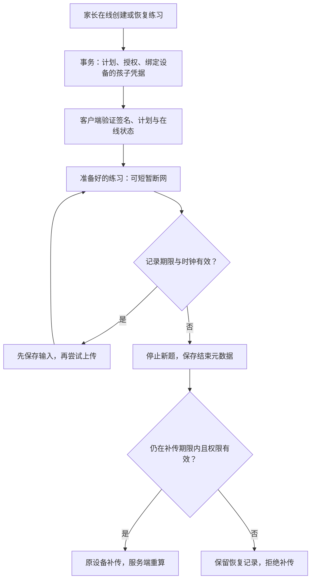

# 已准备练习的离线续练授权

> v0.22 补充：新建练习使用第 2 版授权，绑定 20/25/30/30 分钟总期限和安全间隙询问规则；第 1 版历史授权保持原正文。具体参数、兼容升级及验收见 [单次期限设计](PRACTICE-WINDOW.md)。以下原有设备绑定、日边界与补传语义继续适用。

版本：v0.9.0 · 2026-09-30。适用于新建且带 `continuation_grant` 的本地开发会话。任务内容仍为 0.7.2-preview，原生开发壳仍为 0.2.0。本文记录当前实现，不代表正式离线 App 或生产身份体系已完成。

> 后续进度：v0.10 已接通家长确认结束旧课程资格、原安装补传独立历史和额度结算，见 [换设备与恢复设计](DEVICE-RECOVERY.md)。下文保留 v0.9 授权基线，交接相关的当前状态以新文档为准。

> v0.11 已新增原生端的持久化恢复资料与跨进程时钟检查点，见 [原生断网恢复](OFFLINE-RESUME.md)。下文“重新打开仍需联网”保留为 v0.9 历史行为；v0.12 已接通 [Web 断网重开](WEB-OFFLINE.md)，构建入口可以恢复已准备的原练习。原生设备实际断网重开尚待验收，检查点不等于可信物理时间证明。

## 1. 要解决的问题

孩子已经准备好一份练习时，短暂断网不应立即丢失记录；同时，断网不能让昨天的使用额度无限延续，也不能让另一个设备拿到同一份授权继续做题。

v0.9 为每份新计划签发一份不可变授权，绑定孩子、安装标识、传输方式、完整计划和使用上限。网页与原生端在开始前验证签名和当前服务器状态，然后才能暂时断网续练。重新打开应用或页面仍需联网准备。

### 家庭能够看到的行为

- 准备阶段明确说明：当前练习可短暂断网继续，重新打开需要联网，停止采集会在设备重新连网时生效。
- 到期或发现异常时钟后停止出新题、关闭当前交互并停止音频；用中性提示说明原因，不要求孩子赶在倒计时前完成。
- 截止前已接受的输入先等待保存。全部计划确实完成时可以补记完整结束；其余记录以提前结束保留，不制造漏答或完整成绩。
- 已记录事件可在补传期限内重新上传；普通断网、授权过期和内容不可用不直接删除待同步日志。
- 撤回同意或档案删除仍走清理流程。离线设备无法即时获知远端变更，这一点不能由签名消除。

## 2. 授权结构与校验

实现位于 `packages/session-runtime/authorization.ts`、`prepare-authorization.ts` 和 `apps/api/session-authority.ts`。

| 字段 | 当前约束 |
|---|---|
| kind / version / mode | focus-session-continuation / 1 / local-development |
| sessionId / childId / deviceId | 随机 UUID；安装标识，不是硬件指纹 |
| transport | web 或 native，必须与服务认证方式一致 |
| planHash | 规范化完整冻结计划的 SHA-256 摘要，包含内容与环境条件 |
| maxActiveMs | 与服务端给该次练习的剩余预算完全相等，最多 720,000 ms |
| maxEvents | 3,000；事件接口另限制每批最多 100 条 |
| issuedAt | 服务端签发时间 |
| recordUntil | 签发后 24 小时、内容到期、家庭当天结束，三者中最早时间 |
| uploadUntil | 签发后 7 天；不是在 recordUntil 后再加 7 天 |
| signature | 独立会话公钥标识与 P-256 / SHA-256 签名 |

截止值是开发阶段的工程参数，尚未经家庭使用研究或专业批准。24 小时是授权有效期上限，不是允许连续练习的时长；现有任务预算仍单独生效。

客户端验证顺序：严格结构解析 → 找到用途匹配的公钥 → 验证签名 → 核对会话/孩子/设备/传输方式 → 核对计划摘要及预算 → 核对服务器返回的授权摘要、活动状态和服务器时间。摘要或签名不匹配时不进入练习。

当前公钥通过已登录的本机服务获取；`local-development` 模式不能被解释成生产信任根。原生使用现有 P-256 验证适配，Web 使用 WebCrypto，两者在相同夹具上核对结果。

## 3. 时间、跨日和存储顺序

### 家庭日历

`nextFamilyDay()` 按家庭 IANA 时区查找下一个日历日边界，没有把“一天”固定写成 24 小时。测试覆盖上海、加德满都，以及纽约夏令时切换形成的 23 / 25 小时日。

创建时只读取一次签发时间，用同一个值计算预算所属日期、授权与数据库创建时间，避免跨午夜时出现两套日期。授权重试返回原对象，不重新签发或延长。

### 运行中的时钟

`ContinuationClock` 同时观察系统时间和单调时钟，采用较大的已推进时间。超过容差的回拨、非有限数值或单调时钟回退会锁住本次续练；预检时客户端与服务器相差超过 60 秒也会停止新题目。运行时的高水位只在内存中保存。

这个机制能处理运行中的常见时钟异常，不能证明用户设备的真实物理时间，也不能防御已被修改的客户端或操作系统。当前没有离线冷启动及跨进程可信时钟方案。

### 保存与结束

授权检查发生在接收操作时，在异步保存队列之前。截止前已接受的操作不会因为磁盘较慢而突然变成非法事件；截止后的新呈现、选择和提交则被拒绝。

到期处理先退休当前交互版本，再等待已接受的保存任务，最后根据已保存的回放状态写结束事件。仅中断和结束元数据可以越过记录截止时间；`end: completed` 仍必须由任务引擎确认所有计划步骤已经完成。授权拒绝与存储失败分别处理，不让前者毒化后续的结束保存。

## 4. 服务端生命周期与接口

| 接口 | 行为 |
|---|---|
| POST /children/:id/sessions | 原创建接口新增 continuation_grant；计划与孩子凭据在同一事务内创建，旧凭据同事务撤销 |
| GET /session-authorities | 已登录可读；返回 local-development 和公开验证身份；no-store，不包含私钥 |
| GET /sessions/:id/status | 校验孩子、安装标识、内容、同意和补传期限；返回 id、state、canContinue、grantHash、serverTime |
| GET /sessions/active | 带授权的会话只返回当前绑定设备的活动记录；单独进入孩子空间的未绑定凭据不能读取它 |
| POST /sessions/:id/events、finalize | 权限、撤回、内容及补传期限检查先于重复请求确认 |
| GET /children/:id/export | 增加公开的授权期限/上限/计划摘要，以及 closed_reason；不输出安装标识、完整授权或认证秘密 |

客户端在线时每 30 秒和返回前台时检查会话状态；Web 另在重新联网时检查。只有授权成功准备后的短暂网络失败可以走本机续练；内容召回、权限撤销或其他明确的不可用响应停止继续。

### 额度与未结束会话

当前每个孩子最多一个活动会话：数据库唯一索引、档案锁和预算计算共同避免同时发出第二份额度。另一个安装标识请求活动会话仍收到 `SESSION_CONFLICT`。这是一份排他会话的预算占用，还没有通用的多设备额度预留账本。

超过 7 天且仍未结束的授权，会在下一个有效的新建请求内被关闭，标记 `aborted / upload_expired`，保守地占用原会话的全部预算；原始事件保留，不伪造结果或完成时间。旧请求标识不能复活该授权；永久关闭原因也防止服务器时钟回拨后意外重新接受它。采用新的请求标识才可开始下一份练习。

处于补传期限内的原设备可以重新通过家长验证取得绑定的孩子凭据，恢复原计划并上传，但不能延长 recordUntil。完整的设备接管、带比较版本的接管确认和旧设备冲突展示仍待实现。

### 重要限制

服务端允许记录截止之后、补传截止之前收到事件，因为这是断网补传的必要条件。签名绑定计划和边界，**不能单独证明事件实际上在截止之前发生**；当前实现没有硬件证明或可信事件时间戳，不应将日志用于高风险测量或防作弊结论。

## 5. 迁移、密钥与历史兼容

- 迁移 8：新增 `session_authorities`，会话的 `continuation_grant`，认证会话的 `device_id`。
- 迁移 9：新增会话 `closed_reason`；单独迁移，兼容已应用迁移 8 的本机数据。
- 历史 `continuation_grant = null` 会话保持旧契约；本批的新边界不追溯声称覆盖旧练习。
- 独立本地私钥保存在 `.focus-data/session-signing.jwk.json`；首次创建使用仅属主读写权限，数据库只登记公开身份。服务重启后使用同一身份验证已发出的授权。
- 原生构建目录只复制明确的源文件，不复制家庭数据库或签名私钥。当前没有生产密钥轮换、硬件密钥管理或外部信任根。
- 到期限制不是自动删除策略。7 天本机日志清理、删除传播确认、保留期限提醒及生产备份擦除尚未实现；不得宣称数据会在第 7 天自动从所有副本消失。

## 6. 已取得的验证与下一步

本批 13 项新增检查覆盖签名和设备/计划绑定、时间回拨、跨日、排队保存、截止后完成元数据、未绑定孩子权限、到期补传、永久关闭、原子凭据交接、撤回与内容召回。全部 127 项自动检查和 4 项真实 HTTP 检查通过，两端构建通过。详见 [v0.9 验收记录](qa/authorization-v0.9.md)。

| 下一步 | 负责人 | 通过条件 |
|---|---|---|
| 两端实际交互 | Web/移动 + QA | 真正断网、跨日、挂起/恢复、慢存储、时钟异常都有设备与操作证据；不丢已接受输入，不继续出题 |
| 离线冷启动 | 平台 + 安全 | 受控缓存、已验证授权持久化、跨进程时钟、撤回/召回传播和过期清理形成可测试状态机 |
| 明确设备接管 | 后端 + 两端 | 家长重新验证、比较版本、幂等确认、旧设备失效和额度占用有一致协议 |
| 生产授权 | 平台 + 安全 | 正式信任根、HTTPS、密钥轮换、监控及真实 PostgreSQL 并发验收 |
| 家庭体验与内容 | 方法 + 产品 + QA | 截止与恢复解释易懂，孩子无赶时间压力，四年龄段材料得到实际专业批准 |

以上工程验证不能替代真实儿童可用性、方法适用性或训练效果研究。全球家庭定位、地区准入和完整商业发布要求继续保留在 [实施账本](IMPLEMENTATION.md)。
