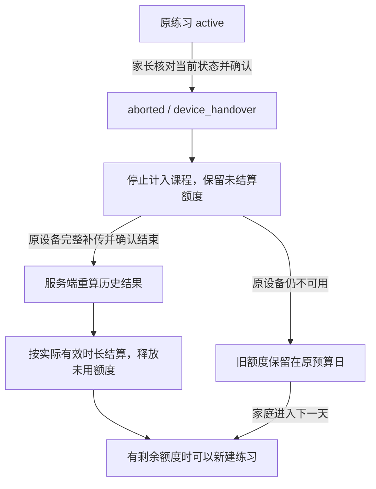

# 未结束练习、换设备与旧记录恢复

版本：v0.10.0 · 2026-09-30。面向全球 6–17 岁家庭的本地开发实现；两端入口已经接通，设备实际交互尚未验收。授权基础见 [续练授权](CONTINUATION-AUTHORIZATION.md)。

后续进度：v0.11 已接通原生已准备练习的断网恢复入口，设计和当前限制见 [原生断网恢复](OFFLINE-RESUME.md)。本文的版本检查数字保留为 v0.10 历史记录。

## 1. 家庭流程

网页首页、原生每份家长档案新增「未结束练习与换设备」。孩子作用域不能管理这些操作，家长需要在最近 10 分钟内重新验证过密码才能确认结束或恢复。

1. 先查看当前练习：任务、开始时间、平台、是否此安装、已收到的操作条数、补传期限。
2. 原设备可用时，优先回到原练习正常结束并同步。
3. 原设备不可用时，家长阅读额度与记录处理说明，勾选确认后结束旧练习的课程资格。
4. 没有活动练习占用课程后，返回首页，按当天剩余额度选择新的练习。
5. 旧设备重新联网时停止出新题，保存结束元数据，并将已有步骤补传为一份独立历史记录。需要重新登录时，可在原安装的恢复入口取得只用于原记录的孩子凭据。

这是明确结束旧练习后另起练习的流程。不会把两台设备的事件拼成一次连续测验，也不会复制旧设备未上传的日志到新设备。默认每份练习占用当日全部剩余额度，所以原设备迟迟无法确认结束时，通常需要等家庭的下一天才能在另一设备开始。

## 2. 状态与额度

- 确认瞬间将原会话标记为 `aborted / device_handover`，暂以原 `budget_ms` 占用当天额度，不编造完成结果或完成时间。
- 合法的原设备凭据在原 `uploadUntil` 内仍可补传。所有事件必须连续且能由原冻结计划回放，具备真实结束事件后才可 finalize。
- 原设备确认完整结束后，以 `ceil(min(budget_ms, activeMs))` 结算；余量才会释放。重复 finalize 返回原结果，不再次改变额度。
- 新建、结束和结算都锁定同一儿童档案，避免与新练习同时分配相同额度。真实 PostgreSQL 的并发、负载与故障切换仍需另行验证。
- 旧签名授权的期限、设备和计划保持不变。网络断开时无法即时通知旧设备，因此界面不会承诺两台设备的物理屏幕在确认瞬间同时停止。
- 安装 UUID、客户端事件时间和结束声明不是硬件证明。当前以受控客户端和服务校验为基础，不宣称可以抵抗被修改的操作系统或伪造物理使用时间。

## 3. 旧记录如何影响报告

`historyOnly: true` 表明这一份记录来自已结束课程资格的旧设备。`completed` 只表示该份冻结计划的步骤是否完成，两者不能混用。

- 原始事件、有效步骤、帮助与中断仍保存，家长逐条记录会清楚标注来源。
- 不增加孩子的完整课程练习次数，不推进课程，不修改难度，也不进入之后的难度证据窗口。
- 周回顾单独统计本周/前周的旧设备记录，不混入正式比较分组；涉及任一周的这类记录时，已有分组也不计算变化，避免选择性排除后制造进步。
- 导出包含 `closed_reason`、结果和公开的交接来源 `{reason, actorScope, closedAt}`，不包含安装标识、请求标识、认证秘密或签名私钥。
- 采集撤回、内容召回、补传到期仍先于重试去重；撤回后旧记录不能继续收集。删除档案级联删除交接来源。

## 4. 接口与并发协议

| 接口 | 输入 | 结果与约束 |
|---|---|---|
| POST /children/:id/recovery | `{deviceId}` | 家长读取 active、最近 20 份 history、家庭日、时区、未分配额度、采集状态；no-store |
| POST /children/:id/recovery/:sessionId/handover | `{deviceId, acknowledged:true}`，If-Match、Idempotency-Key | 最近家长验证；返回 childId、sessionId、closedAt、replayed，不切换家长凭据 |
| POST /children/:id/recovery/:sessionId/resume | `{deviceId}` | 最近家长验证，原安装/原传输方式；返回原会话和服务器事件，并原子切换为绑定安装的孩子凭据 |
| GET /sessions/:id/status | 原绑定孩子凭据 | 新增 historyOnly；已交接记录 canContinue=false |
| events / finalize | 原有事件协议 | 交接后的记录允许在原期限内补传，但只产生独立历史结果 |

`etag` 是当前会话状态、关闭原因、结果与完整已收事件的规范化摘要。客户端原样带 `If-Match`，包括双引号。确认前若旧设备又上传数据或已经正常完成，返回 `HANDOVER_CONFLICT`，刷新后让家长重新决定，不自动重放旧选择。

确认请求的幂等摘要绑定会话、输入、比较版本与认证传输方式。回执丢失时，复用同一请求标识与原比较版本返回已确认结果；相同标识更改内容则冲突。原请求重试不会结束后来新建的另一份练习。撤回与身份校验在去重之前执行。

恢复会话、签发孩子凭据和撤销家长凭据放在同一事务。凭据写入失败整体回滚。恢复回执丢失且身份已切换时，需要重新登录或恢复已保存的孩子凭据，不能凭过期家长凭据重发敏感操作。

## 5. 两端交互和数据保护

`RecoveryClient` / `useRecovery` 共享加载、重复点击保护、未确认请求重试、冲突刷新、保存确认与列表读取失败的区分。页面退出或身份变化时丢弃晚到响应，敏感操作不会在背景自动发起。

Web 恢复页面按需加载；身份切换广播会让其他标签页清除旧家长画面。原生沿用安全存储和身份代次检查，父级进入后台会遮挡并锁定家长页面；安装标识初始化共享同一个进行中的操作，避免首次读取和开始练习同时生成两个 UUID。

原练习收到 historyOnly 状态后沿用续练截止流程：立即退休当前交互、停止语音，先保存已接受操作，再补记合法结束。已完整落盘的步骤仍可确认完整结束，但结果不计入课程。在线检查周期为 30 秒及前台/联网触发；没有实现即时推送。

普通换设备不会删除本机日志。只有原完整日志得到确认后才清除该练习日志；撤回与删除继续遵循对应的数据清理流程。网页现有退出家庭会清除本机缓存，使用前仍应完成同步或导出；本批没有改为长期保留所有已退出家庭的私人数据。

## 6. 存储迁移与兼容

迁移 10 新增 `session_handovers`：原会话主键、档案关联、目标安装标识、请求键/摘要和确认时间。每个原会话只允许一份交接来源，同一档案请求键唯一。目标标识用于确认请求绑定和审计，**不是目标设备未来永久独占该档案的锁**；后续新练习仍遵循一个活动会话的规则。

历史无签名授权的会话可以在原设备正常结束，但不能通过新交接操作改变其旧契约；页面明确显示这一限制。尚未迁移的 v0.1 静态原型记录依然独立。

## 7. 验收与后续要求

本批新增 10 项服务检查、5 项共享客户端检查、1 项周回顾检查；全量 143 项自动检查通过。新增真实 HTTP 流程覆盖 Web → 原生确认 → 服务重启 → Web 原设备恢复与补传，共 5 项 HTTP 检查通过。证据见 [v0.10 验收记录](qa/recovery-v0.10.md)。

以下仍是原完整目标的组成部分：

- 两端真实设备的换设备、网络中断、后台切换、读屏、大字体和旧回调复验。
- 生产身份与监护关系、青少年共享自主性、生产信任根与设备撤销策略。
- 离线冷启动、超过 7 天的本机保留/提醒/清理、完整生产删除传播和备份恢复。
- 正式 PostgreSQL 并发与审计、端到端故障恢复，以及可测量的物理输入/显示条件。
- 四年龄段内容审核、家庭可用性和效果研究；本功能不能被解释为训练效果证据。
