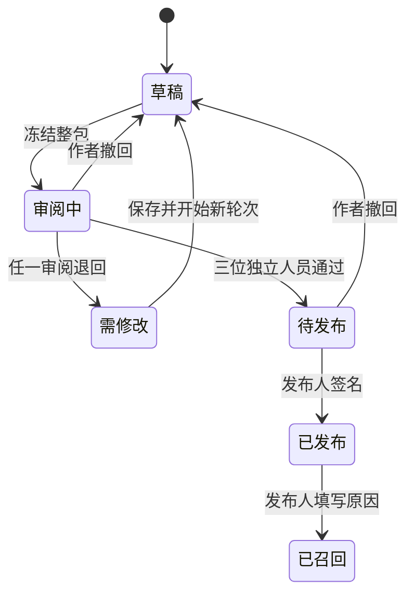

# 家长指导与生活任务的审核发布

2026-10-01 · 本地应用 v0.24 · 数据库迁移 25。面向内容负责人、方法与语言审阅者、发布人员、两端研发和测试。现有家长小课及生活目标已接入独立的版本、三项审阅、签名发布和召回流程；真实专业审核、家庭研究及商业市场准入仍需完成。

## 产品行为

每个年龄包包含九节家长课、四个生活模板及简体中文和英文，覆盖 6–8、9–11、12–14、15–17 四档。编辑可以修改文字；章节顺序、年龄与任务的对应关系由协议固定。内容团队不必通过改应用代码来发布这些文字的新版本。

家长课程读取当前版本。新生活目标保存创建时的模板快照与内容摘要；以后更新当前版本，不会改变已有目标。旧目标可继续使用其原版本，直到原版本到期或被召回。读取课程不会记录阅读次数、推进孩子课程或改变练习成绩。

召回和到期后：

- 受影响的家长课停止显示正文；当前版本不可用时不自动切回旧版。
- 当前版本不再创建目标；绑定停用版本的目标不能接受或填写新回顾。
- 目标仍可停止，待商量目标仍可通过接口拒绝。已保存的记录保留，已分享答案仍可撤回。
- 尚有其他有效当前版本时，可在结束原目标后重新选择。不能把原目标悄悄迁移到新内容。

家庭端显示“待专业审核的预览”或“本地审核预览”。后者只表明软件内的独立审阅流程完成，不等于内容适龄性、效果、审阅人员真实资质或商业准入已被验证。工程验收使用虚构成人账号和明确标注的测试审阅依据。

## 团队操作步骤

1. 编辑登录内容工作台，选择“家长课与生活任务”，从来源包建立新版本。填写未发布过的版本号，例如 `1.1.0-preview`。
2. 按章节、语言修改文字，对照来源版本。未保存的修改会阻止切换队列或送审；可以明确放弃修改。
3. 保存后冻结整包送审。冻结后不能直接改文案；撤回编辑会增加审阅轮次，使之前的批准不再适用。
4. 方法审阅者、中文审阅者、英文审阅者分别阅读九课和四个模板，提交四项检查和不少于 20 字符的依据。语言审阅先选择语言；改变语言范围会清除原阅读声明和检查。每个范围必须由不同账号完成，编辑与发布人不能兼任这些审阅。
5. 发布人核对三项有效审阅、候选摘要和有效天数，输入完整摘要后发布。预览期为 1–30 天，市场固定为 `LOCAL`。
6. 需要停用时，由发布人核对已发布摘要并填写原因后召回。召回不删除家庭数据。修正内容须建立并审阅新的版本。

同一语言审阅账号可在不同稿件承担不同语言，但不能为同一稿件同一轮同时批准中文与英文。账号角色只是软件权限，团队仍须落实实际方法专长、母语能力与独立性。

阅读勾选属于审阅者声明，服务端校验完整章节集合并将其绑定到候选摘要；它不是眼动追踪或真实阅读证明。此功能没有把家庭读课行为纳入追踪。

## 状态与版本

区分三个标识：

| 标识 | 用途 |
|---|---|
| 内容版本，如 `1.1.0-preview` | 同一年龄内容包不能重复发布这个版本 |
| 稿件 `version`、`round` | 前者处理并发编辑；后者隔离每轮审阅 |
| 内容 SHA-256 摘要 | 将文字、年龄、语言、模板、批准及家庭目标引用绑定到具体版本 |

基础代码仍保留 `1.0.0-preview` 未审核种子包，用于初始化与回归检查。服务器保存不可变发布记录后通过年龄渠道选择版本；初始化不会覆盖已发布内容。

## 签名与信任边界

使用现有规范化 JSON、SHA-256 与 P-256 签名能力，复用工作台独立身份、动态验证码和公钥目录。

- 发布正文域为 `family-support-release-1`，审阅正文域为 `family-support-approval-1`。与任务发布格式分开，不能互换。
- 审阅绑定候选摘要、人员、范围、时间、依据和完整章节集合。发布验证方法、中文、英文三范围齐全、人员互异、签名与角色一致，且批准时间不晚于发布时间。
- 发布时再次检查审阅账号是否启用及职责是否仍匹配。改稿、退回和撤回不会让旧批准作用于新轮次。
- 只能发布本地预览；验证器显式拒绝 `production`。不会因为中英文均已填写而开放任何国家。
- 本模块是联网服务。服务端读取时验证签名和摘要；两端校验在线响应契约和所属档案，不在客户端重新验签，也不支持把家庭指导内容离线缓存后继续授权新目标。

这不是抵抗服务端或数据库管理员被攻陷的完整方案。正式部署仍需可信密钥管理、人员停用与公钥生命周期、区域 HTTPS、审计保留及监控，见总体 [技术设计](TECHNICAL-DESIGN.md)。

## 数据库与运行权限

迁移 25 新增：

| 表或字段 | 用途 | 家庭运行账号 |
|---|---|---|
| `family_content_releases` | 不可变签名包、发布状态及召回原因 | 只读 |
| `family_content_channels` | 每年龄当前版本指针 | 只读 |
| `support_drafts` | 草稿、轮次、候选与已发布摘要 | 不可访问 |
| `support_reviews` | 各轮审阅记录与签名 | 不可访问 |
| `support_commands` | 工作台命令的重试去重 | 不可访问 |
| `support_audit` | 创建、修改、审阅、发布与召回记录 | 不可访问 |
| `life_goals.content_hash` | 目标的创建版本外键；历史记录可为空 | 沿用家庭与成员行级权限 |

工作台账号可管理内容表，但不能读取家庭目标或儿童数据。`focus_locked_family_content(text)` 是固定查询的受限数据库函数，让只读家庭账号在事务内取得发布记录共享锁；召回更新与新目标/接受/回顾的校验由数据库锁排序。召回无需遍历或读取家庭记录。

发布事务写入不可变版本、更新年龄指针和稿件状态。低频编辑沿用工作台串行写入边界，避免审核与发布互相锁等待。所有更新均要求正确职责、有效会话、稿件强版本标签和命令去重标识；审核、发布、召回还要求最近 10 分钟内完成动态验证。

PostgreSQL 升级应停止全部旧 API，用迁移身份执行准备命令，再用受限身份启动 v0.24。启动要求 schema 恰为 25。准备命令现从共享常量读取版本，不再输出过时的硬编码数字。详见 [数据库操作](POSTGRESQL.md)。

## 在线接口契约

家庭接口保留现有鉴权和成员范围规则：

| 接口 | v0.24 的变化 |
|---|---|
| `GET /api/children/:id/parent-guide` | 契约 `parent-guide-2-preview`；包含当前包的 `content`、审阅状态及实际章节。召回/到期拒绝显示 |
| `GET /api/children/:id/life-goals` | 新增 `contentPolicy=family-content-1`、当前 `content`、历史引用 `releases`；当前不可用时模板列表为空，但历史可读 |
| `POST /api/children/:id/life-goals` | 必须提交本次读取的 `contentHash`，与年龄渠道不符返回 `FAMILY_CONTENT_CHANGED`；旧客户端缺字段返回 428 |
| `PATCH /api/children/:id/life-goals/:goalId` | 接受或回顾先检查目标绑定版本；停止、拒绝和撤回答案保留原本权限及状态限制 |
| 导出 | 目标增加 `contentHash`，保留原模板快照；不导出工作台账号的秘密信息 |

`content` 含 `hash`、`version`、`review`、`state`。状态可为 `available`、`recalled`、`expired`、`unavailable`；历史 `contentHash=null` 表示尚未绑定发布记录的旧目标，客户端辅助逻辑标记为 `legacy`。旧记录不回填新摘要，不冒充已审阅内容；原有合法关闭/回顾流程保留。

已成功创建的旧命令重试会返回原目标，不创建第二份，也不替换其版本。撤回采集、删除与成员撤销仍优先于重试去重，防止撤销后用旧请求恢复写入。新目标版本不匹配时客户端重新读取，要求用户重新决定，不自动提交原意图。

工作台新增以下路径，继承独立管理 Cookie、Origin、CSRF、请求大小上限与角色检查：

- `GET /api/studio/support`：版本目录与最近 100 份稿件。
- `POST /api/studio/support`：从 `sourceHash` 建立新 `version`。
- `GET /api/studio/support/:id`：正文、来源、审阅及操作记录。
- `PATCH /api/studio/support/:id`：保存完整未审核包；不能更改年龄或任务映射。
- `POST /api/studio/support/:id/submit|reopen|review|publish|recall`：对应冻结、撤回、审阅、发布和召回。

非创建写入需要 `If-Match: "<稿件版本>"`；所有写入需要 UUID `Idempotency-Key`。不同内容复用同一命令标识被拒绝。接口限制完整 JSON 不超过 64 KiB；当前四个基础包均在限制内，工作台保存失败时保留未保存文本。

## 两端交互与召回延迟

家长课、生活目标均使用共享在线客户端。成功变更后重新读取权威状态；刷新失败会清除可操作快照。正常打开时每 15 秒尝试刷新，移动后台调度和断网可能延迟，因此不能保证已显示的旧文字瞬时消失。服务端在每次新写入时检查版本，陈旧客户端不能绕过召回。

召回后隐藏进行中目标的活动步骤及家长提示，保留标题、帮助约定和停止入口。原有历史及答案撤回不依赖当前模板可用。客户端内容更新失败不会改成使用另一份静态模板。

## 验收与待完成项

本批通过 264 项业务测试、12 项 HTTP 流程测试、15 项真实 PostgreSQL 测试，包含三范围独立审阅、签名篡改、生产拒绝、账号停用、版本冲突、召回、到期、损坏数据、历史兼容、并发锁和两套运行身份隔离。Web 与原生类型检查、Web 构建及两平台 Hermes 导出通过。浏览器实际检查双语编辑/冻结、未完整阅读不能批准、切换范围清除声明、中英文课程与召回后保留历史。详见 [验收记录](qa/family-content-v0.24.md)。

仍需完成：专业与母语审阅；原生真机与窄屏/辅助技术验收；更多语言的模式升级、地区与语言独立发布策略；完整固定语音；内容版本到期提醒和替代内容运营；正式密钥/身份与生产监控；家庭理解、负担和效果研究。当前基础文本与 UI 测试批准不能直接用于真实儿童商业发布。
