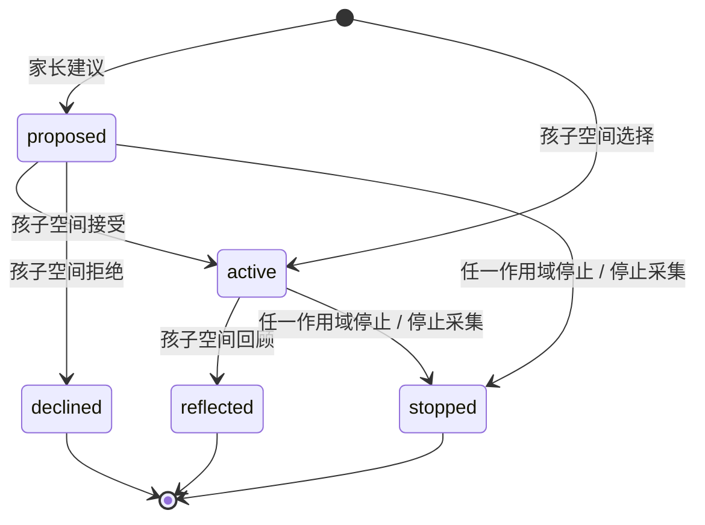

# 家庭生活目标：产品流程与技术实现

更新：2026-10-01 · 平台 v0.27.0 · 基础内容包 1.0.0-preview · 开发预览。

新目标绑定读取时的内容摘要，模板来自按年龄发布的签名包。工作台完成方法/中/英三项独立审阅后可发布本地预览，召回/到期保留历史与撤回分享。基础模板仍待真实专业审核，详见 [家庭内容发布](FAMILY-CONTENT.md)。

## 1. 这次解决什么问题

练习结束后的生活建议，以前只能阅读或由家长填写一次观察。现在 Web 与原生 App 都提供「生活小目标」：提出建议、孩子选择、约定帮助、离开屏幕尝试、回来记录自己的想法。

生活目标与游戏成绩、家长观察分别保存。试过、试了一部分、今天没试都是记录，不用于升级难度、推进课程或生成「专注力指数」。本批没有取得生活迁移效果的研究证据。

目标仍为全球 6–17 岁家庭，首批文本提供简体中文和英语；家庭目标模板尚未专业审核，也未完成母语、适龄与设备可用性验证。当前只供成人使用虚构档案验收。创建者家长可读目标及回顾结束状态，具体答案由孩子选择是否分享；协作家长不能在家长作用域读取此空间。

## 2. 三条进入路径

**家长提出建议：** 家庭空间 → 生活小目标 → 选一项活动和帮助方式 → 保存建议 → 交给孩子，进入孩子空间 → 接受并选择帮助方式，或「这次不选它」。

**孩子自己选择：** 孩子空间 → 生活小目标 → 选择愿意尝试的活动和帮助方式 → 保存 → 在屏幕外尝试 → 回来填写回顾。家长也可直接切换到孩子空间，再由孩子选择，不必先开始一轮计时练习。

**练习结束后查看：** 孩子完成至少一个正式步骤，且练习记录经家庭服务确认后，可自愿从总结页打开相关生活活动。找一找对应 `find`，停一停对应 `turns`，记一记对应 `steps`，持续练习对应 `return`；打开时按档案年龄展示相应文本并预选活动。孩子可以更换或直接离开；只有明确点击保存才创建目标。未确认同步、仅示范、换设备历史记录、离线恢复及内容试玩都不显示此入口。

本入口的 Web 流程和当前 iOS 包启动证据见[本批验收](qa/practice-life-bridge-v0.46-qa.md)。

一份档案最多保留一个待商量或进行中的目标。没有倒计时、连续打卡、积分、排名、补做要求或自动选择的回顾答案。孩子可不选、拒绝或停止；家长可以停止，但不能通过家长作用域代为接受或填写回顾。

### 活动与年龄

| 模板 | 生活策略 | 6–8 岁 | 9–11 岁 | 12–14 / 15–17 岁 |
|---|---|---|---|---|
| find | 按区域找物、按清单检查 | 两件熟悉的物品 | 明天的三件物品 | 自己选择活动，列两三件用品 |
| turns | 轮流表达与选择 | 双方喜欢的小活动，各轮一次 | 双方喜欢的小活动，各轮一次 | 双方愿意讨论的小安排，保留不同意见 |
| steps | 把开始动作拆小 | 两步整理 | 自己的步骤卡 | 小任务的起步；15–17 岁使用个人项目语境 |
| return | 找回当前一步 | 一小段共读或拼装 | 阅读、拼装或项目 | 自己的项目，可留下标记后休息 |

这些是分龄文案与范围调整，不是已验证的年龄常模。清单可以一直看；家长也要遵守轮流；走神不被批评，安静或同意大人不被视为成功。

### 帮助和回顾

帮助选项：陪我做第一步 / 先问是否需要帮助 / 让我先试、需要时求助。建议状态显示「建议的帮助」，接受后才显示「约定的帮助」。

回顾默认不分享，可以跳过问题，只记回顾结束。明确分享时三题都需选择：

- 做了多少：试过 / 一部分 / 今天没试。
- 方法怎样：有帮助 / 没帮到我 / 说不清。
- 接下来：再试 / 小一点 / 换一个 / 休息。

只有明确分享才上传和保存这些选择；不分享时只记录结束，选择在离开回顾后清除。不会根据「再试」自动创建目标，也不会擅自安排提醒。没有自由文本、照片、位置或音视频采集。现阶段新页面为文字交互，不声称已提供对应固定语音。

## 3. 状态和权限



| 操作 | 创建者家长作用域 | 当前孩子作用域 |
|---|---|---|
| 查看本档案目标与历史 | 允许 | 允许 |
| 创建 | intent=suggest，得到 proposed | intent=choose，得到 active |
| 接受 / 拒绝建议 | 拒绝 | 仅 proposed |
| 填写回顾 | 拒绝 | 仅 active |
| 停止目标 | 允许 | 允许 |
| 移除已分享的回顾答案 | 最近家长验证；停止采集后仍可移除 | 本档案、凭据有效时允许 |
| 导出 / 停止采集 / 删除档案 | 最近家长验证 | 拒绝 |

**作用域不是物理身份认证。** 日志中的 child 只表示请求来自孩子空间，不能证明屏幕前是谁，更不能替代可验证监护同意、儿童知情参与或青少年共享授权。目标和回顾结束状态对家长可读，具体答案由孩子逐次选择是否分享。独立青少年身份、逐成员授权和法定权利流程尚未完成。

## 4. 代码与存储

- [模型及严格输入](../../packages/family-support/model.ts)：拒绝额外字段，客户端不能提交模板、分数或声称身份。
- [双语模板](../../packages/family-support/catalogue.ts)：四年龄段各四项。服务端按档案年龄选模板，创建时保存完整不可变快照，包括 version、review、ageBand、task 和双语文本。
- [领域服务](../../apps/api/life-goals.ts)：同家庭/当前孩子隔离、事务锁、幂等、版本冲突、导出和撤回。
- [共享客户端](../../packages/family-support/client.ts)：同步防重复点击、原请求重试、冲突刷新、离开页面后忽略晚到结果。
- [Web 页面](../../apps/family-web/src/LifeGoals.tsx) 与 [原生页面](../../apps/family-mobile/src/LifeGoals.tsx)：相同流程与双语说明。

迁移 7 新增：

| 表 | 关键内容与约束 |
|---|---|
| life_goals | 档案外键、正整数 version、state、模板快照、support、created_by、reflection、时间、closed_reason；档案 + 创建请求标识唯一 |
| life_goal_actions | 目标外键、version、actor_scope、结构化动作、时间和内部去重信息；目标 + version 唯一，目标 + 请求标识唯一 |

数据库部分唯一索引约束每个档案只能有一个 proposed/active。只有 reflected 可有 reflection；迁移 15 将其进一步限定为 family 或 legacy-family，其余分享状态不保存答案。一般动作在同一事务内追加；撤回分享还会清除历史动作中的答案和答案摘要，保留移除标记。事务失败不留下半个目标；这里的本地动作表不是不可篡改的生产审计服务。

读取时锁定档案以取得本次请求的一致结果。v0.27 新增历史接口：当前 proposed/active 目标单独取出并置于每一页上方，另取最多 20 个已结束目标；total 为全部目标数。旧接口保留最多 20 条的原契约，已安装旧客户端仍可使用。

### 历史分页与刷新

已结束目标按 `(created_at, id)` 倒序，每次查询 21 条以判断是否有下一页。位置保存数据库的 UTC 六位小数时间和 UUID，不经 JavaScript 毫秒时间转换；边界记录删除后仍可继续查找。游标含版本、集合与孩子标识，只表示位置，每次请求都重新验证身份和孩子权限。重复、未知、跨孩子及错误格式参数均拒绝。

客户端只保留当前页记录及内存中的位置栈。创建或结束目标后回到第一页；在旧页移除分享答案后保留页码。成功翻页后 Web 将焦点移到历史标题；原生端提供相同的页码、创建日期、前后页与末页说明。

每 15 秒的后台读取保留当前页，不锁住翻页或保存按钮。显式读取、翻页或写入会递增读取代次，使晚到的后台结果不能覆盖新页面。离开页面后忽略所有晚到回执。网络翻页失败保留原页并就近提示；权限或契约失败清除记录。后台读取失败也会清除当前显示并要求重新读取，不能把“翻页失败保留”理解为完整离线浏览。

分页是实时查询，不是跨页冻结快照：其他设备创建或结束目标会影响最新页与总数；原先很早创建的开放目标后来结束时会按其创建时间进入历史。显式“读取最新目标与记录”回到第一页。当前目标在上方的规则不改变历史排序，也不把生活结果换算成练习分数。

## 5. 接口契约

沿用 [本地运行接口](LOCAL-API.md) 的认证、来源、CSRF、传输和错误格式。以下均相对 `/api`。

### 单独进入孩子空间

`POST /children/:id/enter`，请求必须为 `{}`。需要家长身份，确认档案仍在采集，并在同一事务中锁定和撤销当前家长会话、生成绑定该孩子的会话。不会创建练习或增加使用次数。

Web 设置 HttpOnly Cookie，返回 `{child, csrf}`；原生返回 `{child, accessToken}`，不设置 Cookie。两种凭据不能交叉使用。原生复用现有安全存储和身份代次保护；Web 通知其他标签页清除旧家长视图。

切换身份后如果响应丢失，应重新进入家庭空间恢复身份；此身份切换没有通用离线队列，不把旧家长身份留作回退凭据。

### 目标读取与创建

`GET /children/:id/life-goals` 返回：

```json
{"childId":"…","role":"parent","sharingPolicy":"reflection-sharing-1","collectionActive":true,"templates":[],"goals":[],"total":0}
```

`templates` 的实际响应含四个分龄模板；`goals` 是当前目标及近期历史。响应 no-store。

新客户端使用 `GET /children/:id/life-goals/history?cursor=…`。首请求省略 cursor；响应保留原字段，新增：

```json
{"history":{"version":"life-history-1","pageSize":20,"nextCursor":null}}
```

有后续页时 nextCursor 为不透明的位置字符串，原样传入即可；末页为 null。`goals` 为最多一个当前目标加最多 20 个已结束目标。无效位置返回 `400 INVALID_LIFE_HISTORY_CURSOR`；旧服务缺少新协议时，新客户端停止展示并提示更新。Cookie/Bearer 隔离、no-store、创建者权限和绑定孩子权限继续执行。

`POST /children/:id/life-goals`，带 `Idempotency-Key`，例如：

```json
{"intent":"suggest","templateId":"steps","support":"ask-first"}
```

家长只能 suggest，孩子只能 choose。返回 201 `{goal, replayed}`。同档案、同请求标识和相同规范化内容重试不重复创建；内容或角色不同返回 409。已有开放目标返回 `GOAL_EXISTS`。

### 状态变更

`PATCH /children/:id/life-goals/:goalId`，带 `Idempotency-Key` 和 `If-Match: "1"`。后者由此前读到的 goal.version 构造，必须是带引号的正整数强版本标记，不接受弱标记、星号或多个版本。

```json
{"action":"accept","support":"space"}
```

其他请求为 `{action:"decline"}`、`{action:"stop"}`，或：

```json
{"action":"reflect","sharing":"family","reflection":{"outcome":"partly","helpful":"unsure","next":"smaller"}}
```

不分享请求为 `{"action":"reflect","sharing":"none"}`，不得含答案；移除为 `{"action":"unshare"}`。旧客户端缺少分享选择返回 428，新客户端拒绝缺少 sharingPolicy 的旧服务。

成功返回 `{goal, replayed}`；首次变更 version 加一。缺少版本返回 428，版本格式错误 400，版本落后或状态不符 409；关闭后不重新打开。相同动作重试返回目标的**当前状态**，不会用旧回执把后续变更覆盖掉。版本、请求内容和作用域一起参与去重摘要。

档案权限校验先于去重；停止采集后不允许旧新增/回顾请求写入，删除后旧请求不能复活档案。最近验证的家长仍可移除已有分享答案；曾分享但已移除的旧请求返回 REFLECTION_WITHDRAWN，不恢复答案。

## 6. 保存、并发和数据管理

当前目标页面需要联网，不采用离线乐观成功。服务器回执前显示读取/保存中，重复点击共用一次操作。响应不确定时保留同一请求标识供当前页面重试；离开页面不会冒充已保存。刷新或重新打开后先读服务器状态。

每次写入确认后，再读取服务器的列表和总数。若写入成功而刷新失败，明确显示「选择已保存，但最新列表未读取到」，暂停后续变更，直到重新读取成功。遇到冲突只刷新，不自动重新执行过时的拒绝、停止或接受。

停止采集在同一事务内将开放目标改为 stopped，写入 withdrawn 原因和一条动作记录；重复撤回不增加重复关闭记录。旧历史对已验证家长仍可读。删除档案通过外键级联删除全部目标和动作，旧请求不能复活档案。

既有 schemaVersion=1 导出新增 `life:{goals,actions}`，包括完整历史和模板快照；不导出内部请求标识、摘要或认证信息，原生导出序列化器继续检查嵌套敏感字段。周回顾仍只汇总原有家长观察，尚未把目标反思纳入周报，也不将两者相加。

## 7. 验收和后续

本批历史分页、后台刷新与权限验收见 [v0.27 记录](qa/life-history-v0.27.md)。282 项业务和 14 项 HTTP 检查通过；新增独立 PostgreSQL 用例因 Docker 环境异常未启动。两端运行代码导出通过，原生设备行为须另行验证。

自主分享、撤回事务和历史兼容见 [分享设计](REFLECTION-SHARING.md) 与 [v0.16 验收](qa/reflection-sharing-v0.16.md)；基础流程历史证据见 [v0.8 验收记录](qa/life-v0.8.md)。Web 页面与样式按用户打开入口时加载，本批没有增加原生依赖、外部账号或付费 API。

仍需完成：

1. 双语与四年龄段的专业审核，以及儿童/青少年自愿参与和家长可见说明的理解测试。
2. 浏览器窄屏、键盘、读屏；iOS/Android 真机大字体、后台恢复、身份交接与错误提示体验。
3. 独立青少年身份、逐成员共享授权和正式家庭成员关系；利用已接通的家庭内容签名、审阅与召回流程完成真实专业审核及发布运营。
4. 独立 PostgreSQL 的新增历史用例复验、正式保留期限、云端删除与备份流程；本地事务与重复请求测试不等于生产压力与并发验收。
5. 将生活目标与家长支持课程、完整课程编排相连，并通过适龄研究验证实际生活结果；不能凭记录数量或自报帮助感宣称效果。

首批国家/地区与经营主体仍待确定。全球商业发布、专业内容审核、研究与设备验收的原有要求保持不变。
