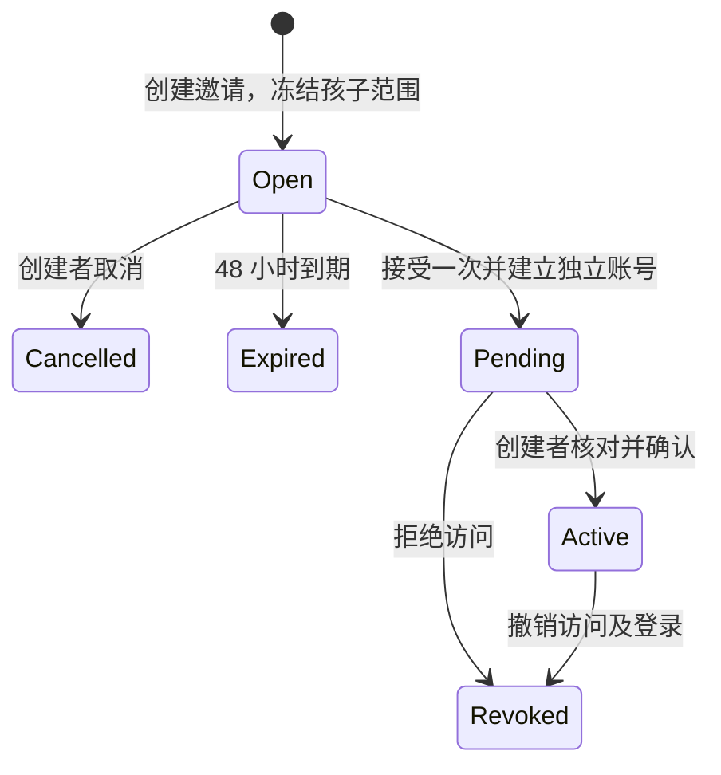

# 家长协作、独立账号与邀请

2026-10-01 · 本地应用/API 0.23.0 · 数据库 schema 24 · 契约 `family-members-1`。本批完成家庭成员这一工作包，继续服务全球家庭、儿童与青少年产品目标。正式身份、监护关系核验和地区准入仍按 [执行计划](DELIVERY-PLAN.md) 推进。

## 1. 家庭中的实际流程

创建者在「家庭空间 → 家长协作」选择孩子，核对开放范围后生成邀请码。受邀家长在登录页选择「接受邀请」，设置自己的登录名、称呼和密码；此时只显示等待确认页。创建者与对方核对登录名、再次确认孩子范围，才开放访问。

现有家庭自动迁移为一位 `owner` 创建者，原密码、原登录和孩子记录保留。受邀成员登录时填写家庭名称、自己的家长登录名及自己的密码。创建者登录名固定为 `owner`。这是本机家庭内的独立账号，尚未建立跨家庭的全球身份或恢复渠道。

一份邀请只对应一次加入，不自动向外发送信息。邀请码由创建者自行交给认识的家长。每个家庭当前最多四位未撤销家长；尚未到期、接受或取消的邀请占用一个名额。这是开发版容量限制，商业套餐与家庭结构限制仍需研究。

## 2. 权限矩阵

| 操作 | 创建者 | 已确认协作家长 | 待确认账号 |
|---|---|---|---|
| 查看孩子列表 | 所有本家庭孩子 | 邀请时选择的孩子 | 不返回孩子名称、ID 或记录 |
| 开始练习、进入孩子模式 | 可以 | 所选孩子 | 不可以 |
| 查看练习记录、周回顾、日常观察 | 可以 | 所选孩子 | 不可以 |
| 添加日常观察、阅读家长小课 | 可以 | 所选孩子 | 不可以 |
| 查看练习安排 | 可以 | 所选孩子，只读 | 不可以 |
| 修改练习安排、添加孩子 | 可以 | 不可以 | 不可以 |
| 家长端生活目标与回顾 | 可以 | 不提供读取或修改 | 不可以 |
| 原安装恢复练习 | 可以 | 所选孩子，保留原授权与期限 | 不可以 |
| 接管另一设备、导出、停止采集、删除 | 可以，保留最近验证要求 | 不可以 | 不可以 |
| 邀请、确认、撤销成员 | 最近十分钟内验证的创建者 | 不可以 | 不可以 |
| 查看成员列表 | 本家庭成员及最近 20 份邀请 | 仅自己 | 仅自己，不返回孩子范围 |
| 修改密码、退出全部登录 | 自己的密码；撤销全家庭登录 | 自己的密码；仅撤销自己签发的家长/孩子登录 | 与协作账号相同 |

“日常观察”是家长填写的结构化活动记录；“生活回顾”是孩子在生活目标中选择分享的答案，两者独立处理。成员范围在本批固定；改变范围需要撤销原成员、重新邀请并使用未占用的登录名。未提供转让创建者、重新激活撤销成员或管理员代改密码。

**孩子模式仍是共享设备上的操作作用域。** 已获准进入孩子模式的成人也可能操作孩子界面；当前系统不能证明屏幕前是谁。因此本批不能作为独立青少年隐私隔离的完成证据。独立青少年身份、逐成员分享选择、成年转换和监护争议流程仍是后续必需工作。

## 3. 状态与交互

- 邀请秘密使用 32 随机字节，以 64 位十六进制显示，服务端只保存 SHA-256。仅创建成功响应包含明文；列表、审计和孩子导出不包含它。刷新或离开后不再展示；丢失可取消未使用邀请后重建。
- 邀请 48 小时到期，接受与消费在同一事务；重复接受不能建立第二个账号。同一用户名冲突时整个事务回滚，不消耗邀请。
- 受邀账号默认 `pending`，确认前不能开始、恢复、读取孩子记录。已有成员不能通过加入请求提交自己的角色或孩子范围。
- 确认、撤销和取消前展示具体对象及孩子范围，并要求单独勾选。确认成员使用 `If-Match` 当前版本，过期画面不能覆盖新权限。
- 客户端串行提交。网络结果不明时清空旧列表及邀请码，要求重新读取，不自动重发敏感命令。离开页面后忽略晚到响应。
- Web 在同一家庭切换成员时重建页面组件并重新读取报告，避免继承前一位家长的显示状态。
- Web 加入请求提交期间锁住身份页切换并清空密码表单；原生端使用既有身份代次保护。界面提供中英文文案和原生对应页面。
- 已撤销账号不再登录；当前浏览器收到 401 后清除家庭画面和本机访问资料。家长页面另在可见时每 30 秒及重新获得焦点时检查身份。该轮询不是实时推送承诺。

## 4. 服务端与数据库

共享模式位于 `packages/contracts/family-members.ts`，逻辑位于 `apps/api/family-members.ts`，两端共用 `FamilyMembersClient` 的读取、提交、冲突及销毁状态。当前生产开关仍关闭。

每个登录凭据绑定 `member_id`；开始练习、进入孩子模式和恢复生成的凭据继承它。每次业务执行在事务内重新检查登录、成员状态及范围。所有家庭写入共用家庭行锁；加入使用“家庭锁 → 邀请锁”的固定顺序，避免与创建者操作死锁。

| 迁移 | 作用 |
|---|---|
| 20 | 新建 `family_members`、`family_invitations`；迁移原创建者及原凭据；按成员范围限制孩子可见性 |
| 21 | 新建 `family_member_audit`，记录邀请、接受、确认、取消和撤销；不写密码或邀请码 |
| 22 | 令牌写入校验覆盖所有权限分支，孩子必须在当前可见范围内；也修复曾加载过中间开发版本的数据库 |
| 23 | 阻止协作账号在家庭作用域中自改角色、状态或孩子列表，仍允许更新自己的密码 |
| 24 | 数据库拒绝协作家长作用域读取生活目标，其动作记录继承这一限制；孩子作用域维持原规则 |

PostgreSQL 受限运行角色覆盖 13 张家庭表，启动要求最高迁移版本恰为 24。身份通过服务端验证后写入事务局部设置；请求体不能直接设置这些权限。PGlite 本机运行使用数据库所有者，仍依赖服务层验证；真实 PostgreSQL 测试另外证明行级策略生效。

邀请创建需要 `Idempotency-Key`。重复标识返回 `INVITE_ALREADY_CREATED`，不尝试还原一次性秘密。成员操作要求强版本标签，例如 `If-Match: "1"`。完整路径见 [本地接口](LOCAL-API.md)。

## 5. 撤销、竞态与历史兼容

撤销成员与删除其家长及派生孩子凭据在同一事务提交。并发请求若已在撤销前完成，其已保存记录保留；撤销后开始执行的旧身份请求被拒绝。撤销不删除孩子、练习、结果或待恢复会话。创建者仍可使用恢复流程处理未结束练习。

离线设备无法即时收到撤销；已经在线准备的练习仍受原签名总期限约束。联网请求先验证有效身份，不能凭旧邀请码或签名绕过撤销。未同步的本地日志处理继续服从现有清理与恢复规则，不能承诺撤销后旧设备仍能补传所有离线记录。

成员密码错误次数和冷却独立，登录与账号命令共用该成员计数。修改协作家长密码不改变创建者密码，也不退出其他成员；创建者改密码或全部退出保留原来的全家庭撤销语义。孩子档案停止采集和删除继续沿用原校验。

迁移测试从真实 schema 19 升到 24，再次执行迁移不重复生成创建者；原密码哈希、冷却计数、家长凭据、孩子凭据和既有孩子资料保留。运行数据库升级前仍须执行适用的备份与恢复流程；没有把本机迁移测试当成生产恢复演练。

## 6. 验收与下一步

本批 259 项业务检查、12 项真实 HTTP 检查、14 项 PostgreSQL 检查通过。Web 和原生类型检查、Web/工作台构建、双平台 Hermes 导出通过。浏览器使用虚构家庭验证待确认、所选孩子、只读安排、确认表单与撤销后清屏，详见 [验收记录](qa/family-members-v0.23.md)。

完整研发团队接下来可以据此接入正式身份契约：全球账号与区域家庭成员映射、找回与 MFA、监护关系和用途同意、独立青少年授权、成员/登录审计与安全通知。本批审计表还不是防篡改外部审计系统；新密码人工提交、原生设备操作和屏幕阅读器仍需实测。研究效果、专业与母语审稿、实际市场上线条件不会由本批工程检查自动满足。
