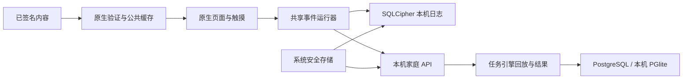

# 原生家庭 App：已实现设计与开发交接

更新：2026-10-02。当前平台源码 v0.46.0，移动端壳版本 0.2.8，任务引擎 2.0.0。iOS 26.5 模拟器的较早本机签名包已完成 Keychain 写入/重启读回、固定语音控件、练习、服务端同步、家长报告和 SQLCipher 文件初查；最新提交的完整源码另在全新 iPhone 17 Pro 首装和 iPhone 17 更新后正常打开，曾安装诊断包的 iPhone 17e 仍因 Keychain entitlement 缺失报 `-34018`，未重复整条交互。Android 16 / ARM64 模拟器已完成首次安装、虚构家庭、离线强退重开、补传、家长报告和丢密钥停止验收；真机与系统中断矩阵仍待测。详见[Android 模拟器验收](qa/android-emulator-offline-v0.46-qa.md)、[当前 iOS 验收](qa/ios-simulator-current-v0.46-qa.md)与[语言首屏验收](qa/native-locale-v0.46-qa.md)。面向全球 6–17 岁家庭的完整产品目标保持不变。

首次打开按设备偏好选择已支持的英语或简体中文，登录页仍可手动切换；登录后采用家庭保存的语言。系统仅声明这两种语言，繁体中文和其他语言暂回退英语。原生配置、编译和设备验收范围见[语言入口验收](qa/native-locale-v0.46-qa.md)。

## 1. 当前可以交接的内容

`apps/family-mobile` 使用 React Native 和 Expo，直接渲染原生控件、SVG 和图片，接入已有家庭服务。四类练习共用服务端冻结计划、事件协议、评分器及内容签名规则，页面未使用 WebView 包装 Web 应用。

| 范围 | 本批实现 | 尚待完成 |
|---|---|---|
| 家庭入口 | 建立本机测试家庭、独立家长账号/邀请、添加四年龄段档案、中英文字、最多三个孩子 | 正式全球身份、恢复、可验证监护同意、地区开放策略 |
| 儿童/青少年 | 儿童素材和青少年图形主题、推荐课程及自由选择、帮助和退出 | 四年龄段完整设计与母语审阅；独立青少年身份与访问策略 |
| 四类任务 | 搜索、抑制反应、顺序记忆、短段监测；固定窗口、理解检查、休息与技术中断 | 真实设备时序校准、可访问性和专业适用性验证 |
| 记录 | 先加密保存事件、再上传；同内容重传、中断恢复；原签名授权、素材与日志核验、断网恢复入口和时间检查点 | 断网重开设备验收、生产授权与保留期限、换设备流程真机验收 |
| 媒体 | 签名和摘要核验、公共素材缓存、解码准备、固定 MP3 手动播放及播放器失败时文字降级、新版图片和字节预算；源码内容现已覆盖 32/32 个分龄双语组合 | 母语听审、原生音频设备播放与视觉辨识验收 |
| 家长 | 再次登录查看记录、观察与历史翻页、资料管理、规则化周回顾、家长课和生活目标 | 周回顾可读性/设备验收；系统导出与后台交互；异步报告、课程专业审核与独立青少年共享边界 |
| 发布 | 本地开发配置、生产模式启动门槛、两平台运行代码与开发包编译；iOS 和 Android 模拟器已安装并完成各自部分流程 | 真机矩阵、发行签名、商店/支付/客服与商业准入 |

Web 与原生已接通观察和资料管理，但交付与清理方式不同：Web 下载文件并清理浏览器缓存；原生还导出此设备的恢复日志，通过系统保存/分享交付，并清理 SQLCipher 日志。系统交互仍须设备验收，详见 [家长资料管理](PARENT-DATA.md)。

## 2. 代码与职责

| 位置 | 职责 |
|---|---|
| `apps/family-mobile/src/App.tsx` | 身份页面、家庭与档案选择、家长入口、后台遮挡 |
| `apps/family-mobile/src/ParentSpace.tsx` | 记录、观察、资料范围与再次验证身份、处理结果 |
| `apps/family-mobile/src/FamilyArtwork.tsx` | 打包的装饰图、读屏隐藏与加载失败处理 |
| `apps/family-mobile/src/WeeklyReview.tsx` | 最近 52 周导航、缺口与条件展示、后台请求失效 |
| `apps/family-mobile/src/exports.ts` | iOS 临时分享文件清理、Android 用户选定目录保存 |
| `apps/family-mobile/src/Practice.tsx` | 原生呈现/触摸适配、练习阶段、暂停/帮助、音频与召回检查 |
| `apps/family-mobile/src/Stimulus.tsx` | 原生 SVG 和已验证图片的刺激图形 |
| `apps/family-mobile/src/client.ts` | 本机 Bearer 会话、SecureStore 儿童凭据、超时、随机设备标识 |
| `apps/family-mobile/src/storage.ts` | SQLCipher 日志、随机数据库密钥、所有者检查、同连接串行事务与阻止标记 |
| `apps/family-mobile/src/content.ts` | 签名发布包、任务绑定、素材下载/缓存/校验/解码 |
| `packages/session-runtime` | 与 UI 无关的持久化事件队列、恢复、顺序补传和确认 |
| `packages/task-engine` | Web/原生/服务端一致的计划与事件回放；不信任客户端成绩 |
| `packages/content/native-verifier.ts` | 原生可用的 SHA-256 与 P-256 验证适配器 |
| `packages/contracts/models.ts` | 客户端共享的家庭、会话和结果模型 |



UI 仅提供实际输入、呈现近似信号和中断事件，不能直接提交正确率。响应窗口在呈现时开放，输入按发生时间排队；已持久化事件和成绩状态只有在日志成功保存后才发布。写入期间显示「正在记录」，失败不会伪装成已保存。服务端回放仍为结果依据。

## 3. 身份与家庭隐私

### 两种传输方式分开验证

Web 使用 HttpOnly Cookie 和 CSRF；本地原生端使用 `X-Focus-Client: native-local-v1` 与 Bearer。数据库迁移 4 给身份会话增加 `transport`，现有会话迁移为 Web。服务拒绝跨传输凭据混用，并拒绝带浏览器 Origin 或 Cookie 的原生请求；该标记本身不构成身份凭据。创建任务时平台条件也必须与传输方式匹配。

原生家长令牌仅在内存中。开始练习后服务端撤销旧家长令牌并返回只绑定该孩子的令牌，后者进入 SecureStore。存储更新串行执行：后台切换期间晚到的儿童令牌必须清除，然后才允许新身份写入，避免交错覆盖。随机设备 UUID 不从硬件信息生成。切到后台时，家长会话锁定、家长报告关闭；正在进行的登录响应通过版本检查防止恢复过期的家长状态。儿童练习保留挂载以便记录中断。

当前后台遮挡由 AppState 驱动；系统任务切换器截图、快速前后台、锁屏期间的存储可用性均需真机检查，尚未声称全部防护通过。身份切换、网络取消和并发点击还需设备端竞态验收。

### 私人数据与公共素材

- 未确认事件放 SQLCipher，数据库密钥是随机 32 字节，通过系统安全存储保存。运行时检查 `cipher_version`，未提供 SQLCipher 的构建直接失败，没有明文降级。密钥丢失但数据库存在时保留文件并停止，不覆盖旧记录。
- 日志以家庭、孩子、会话绑定；数据库查询使用参数，不允许另一位家庭成员接管已有日志。全部数据库访问在同一条已设置密钥的连接上串行执行。确认撤回后写入阻止标记并清理日志，晚到写入仍被拒绝；不使用会新开未设置密钥连接的独占事务辅助接口。
- 家长登录以完整服务端档案列表核对本机记录；已删除或撤回的档案清理失败时不伪装成功。阻止标记只保留家庭/档案随机 id，正式保留期限与擦除策略仍待审阅。
- 登录失败、断线或普通授权过期不会直接抹掉未同步记录。退出家庭会清除儿童凭据，不等同于删除档案。
- 图片/音频缓存只包含公共内容，不含昵称和事件；每次加载仍校验长度与摘要，已缓存文件也不能跳过校验。
- Android 开发配置关闭应用备份，阻止摄像头、录音、定位与旧式外部存储读写权限；最终 0.2.0 APK 清单已确认这些设置。音频插件关闭麦克风及后台录音/播放，同时关闭未使用的 Face ID 声明。安装包仍有生物识别和调试悬浮窗等依赖声明；正式清单及系统实际权限表现仍待验收。

配置 SQLCipher 是实现前提，不能替代设备上检查数据库确实无法被明文读取的验收。Expo Go 不提供这套 SQLCipher 配置，需自行生成原生开发构建。[Expo SQLite 文档](https://docs.expo.dev/versions/v57.0.0/sdk/sqlite/)

## 4. 任务时序、暂停与恢复

1. 请求冻结计划；新授权需验证签名、安装标识、计划、预算和在线状态。继续验证发布签名、任务/语言/年龄/引擎绑定和所有素材，图片可解码后才进入练习。
2. 创建运行器，合并服务器记录和本机日志，对相同序号的完整嵌套事件做规范化比较。缺失或冲突时停止继续写入。
3. 上个进程留下活动题时追加 `reload` 中断；原题重新呈现，不伪造漏答或沿用不可信显示时长。
4. 输入先在调用时获取单调相对时间，再排队保存；固定响应窗口内的重复触摸仍保留。帮助、休息、后台、帧卡顿与计时延迟分别处理。
5. 补传从服务器的**连续前缀**开始，不能把服务器事件总数当作已确认序号。例如仅收到第 3 条时，1、2 仍须补传。这一修复也应用于 Web 恢复逻辑。
6. 每批最多 100 条，确认回执须前进且不超出本次快照。结束记录和 finalize 均确认后才删除日志。回执丢失可用相同事件重传。

v0.5 修复了按整批开始状态过滤中断的错误，两端按操作顺序处理 `present → interrupt`。响应窗口独立于日志写入速度；暂停立即退休当前交互版本，原生帧观察、延迟保存及计时器不能影响之后重做的题目。准备材料时进入后台，也不会在加载完成后自动进入练习。实现与针对性检查见 [计时与中断记录](qa/interaction-v0.5.md)。

当前 `native-frame` 是协议枚举名；实现采用 JavaScript 的相邻 `requestAnimationFrame` 和卡顿检查，**没有实现物理屏幕呈现时间或原生输入延迟测量**。触摸进入 JS、日志写入和渲染的延迟仍需测量，不能把当前反应时视为标准化测验值。设备、输入、内容版本作为比较条件分开保存。

新授权的会话在线时每 30 秒及重新回到前台检查状态，覆盖内容召回、采集权限和补传期限。运行中每秒及返回前台检查授权和异常时钟；到期先阻止新交互、等待已接受的保存任务，再记录结束。授权最迟在家庭当天结束时到期；断网仍无法即时获知远端撤回/召回。v0.11 已增加原生重开时的恢复入口：凭据、原授权、日志、素材和时钟重新核验通过才开放；详见 [原生断网恢复](OFFLINE-RESUME.md)。

## 5. 构建和本机运行

### 普通检查

项目根目录执行：

```sh
npm ci
npm run check
npm run mobile:check
npm test
npm run test:http
npm run build
npm run mobile:bundle
```

移动端命令统一通过 `scripts/mobile.mjs` 运行，关闭 Expo CLI 遥测。`mobile:bundle` 在 `dist/mobile` 输出 iOS/Android Hermes 运行代码；这不是 `.ipa`、`.app`、`.apk` 或 `.aab`，单独不能安装。

版本锁定：Expo 57.0.26、React Native 0.86.3、原生 React 19.2.3。Web 使用 React 19.2.7，因此 Metro 强制所有原生依赖解析到原生 React，避免宿主渲染器版本不匹配。工作区依赖仍需按锁文件安装。[Expo SDK 版本说明](https://docs.expo.dev/versions/latest/)、[Expo 单仓库说明](https://docs.expo.dev/guides/monorepos/)

### 建立隔离的原生构建目录

本项目目录名带隐藏字符，系统旧 Ruby 的路径处理曾失败。执行：

```sh
npm run mobile:prepare-build
```

命令返回临时目录及 `.focus-native-source.json` 源码快照，只复制明确列出的源码、锁文件和已安装依赖，不复制 `.env`、家庭数据库、签名私钥、缓存或已生成 iOS/Android 工程。快照记录产品版本、原生壳版本及每份源码的字节数和 SHA-256。进入返回的目录后执行：

```sh
node scripts/mobile.mjs prebuild --no-install
```

`app.config.ts` 是配置来源；不手工修改生成目录作为永久修复。iOS 使用 Xcode、Ruby/Bundler 和锁定的 CocoaPods 1.16.2；在 `apps/family-mobile` 安装 Gemfile 后，于 `ios` 执行 `bundle exec pod install`。本机 Ruby 2.6 的临时兼容过程及实际编译结果见验收记录。团队 CI 应提供受维护的 Ruby 环境并冻结工具链，避免依赖系统旧 Ruby。

历史 0.2.0 iOS 模拟器 Debug 产物保存在 `dist/mobile-native/v0.5/ios-simulator/`，已安装到 iPhone 17 / iOS 26.5，未完成 App 交互验收。前一批 0.1.0 产物仍在 `dist/mobile-native/ios-simulator/`，请勿混用；开发壳编译证据见 [v0.5 验收记录](qa/parent-data-v0.5.md)，当前内置代码产物与运行代码的检查见 [v0.11 验收记录](qa/offline-v0.11.md)。

安装 Pods 后，从 `apps/family-mobile/ios` 构建模拟器目标，不需要商业签名账号：

```sh
xcodebuild -workspace FocusIslandDev.xcworkspace -scheme FocusIslandDev \
  -configuration Debug -sdk iphonesimulator \
  -destination 'generic/platform=iOS Simulator' \
  -derivedDataPath ../build-ios CODE_SIGNING_ALLOWED=NO RCT_METRO_PORT=4183 build
```

本机若存在外部 GCC 配置，构建命令还需显式将 `CC`、`LD` 设为 Xcode 的 Clang，`CXX`、`LDPLUSPLUS` 设为 Xcode 的 Clang++；用 `xcrun --find clang` 获取安装路径，勿修改全局环境。

刷新依赖目录后必须重新执行 Pods 配置：Expo SQLite 在该步骤按配置生成 SQLCipher 的 C 源码与头文件。不能仅复制新的依赖后直接复用旧编译缓存。若出现 `exsqlite3_*` 接口缺失，先核对 Pods 配置和生成头文件，再用新的专用 DerivedData 目录复验，不能通过关闭加密绕过错误。本机旧 Ruby 需要先加载锁定的 Bundler，再加载对应的 logger；团队 CI 仍应使用受支持 Ruby。

Debug App 还需移动开发服务；源目录运行 `npm run dev` 提供家庭 API，在用于编译的同一隔离目录运行 `npm run mobile:start`，端口 4183。未配置时原生 API 指向 `http://localhost:4181`，支持 iOS 模拟器；Android 模拟器需本机开发端口转发（4181 和 4183）。真机上的 `localhost` 是手机自身，不能用它连接开发机。

测试远端 HTTPS 服务时，在**预生成原生工程、导出运行代码和编译 App 的同一构建环境**设置公开变量 `EXPO_PUBLIC_FOCUS_API_ORIGIN` 为服务根地址（例如 `https://api.example.test`，不含 `/api`、账号、查询参数或片段）。App 会对请求和签名素材使用同一根地址；无效地址及远端 HTTP 在构建配置阶段被拒绝。远端构建关闭 Android 明文网络许可和 iOS 本地网络例外。本机测试仍允许回环地址 HTTP。该变量会写入安装包，只能放公开地址，不能放令牌或密钥。[Expo 官方环境变量说明](https://docs.expo.dev/guides/environment-variables/)

这只是连接配置，不会开放新市场或绕过服务端授权。当前 Vercel 预览受 Vercel Authentication 保护，原生 App 不能直接完成该网页登录；不要把预览绕过凭据编入 App。正式区域路由、可验证监护同意、真实设备联调和生产发布仍待完成，见[远端路由验收](qa/mobile-api-routing-v0.46-qa.md)。

### Android 开发包

本批在隔离目录安装并校验 Temurin JDK 21.0.12.1、Android SDK/Build Tools 36、NDK 27.1.12297006、CMake 3.22.1，未替换系统 Java。依赖源与下载校验记录保留在构建目录的 `.native-tools/android-build/`。Gradle wrapper 9.3.1、AGP 8.12.0 由当前工程固定。

将 `JAVA_HOME`、`ANDROID_HOME`、`GRADLE_USER_HOME` 指向团队安装位置后，从 `apps/family-mobile/android` 执行：

```sh
./gradlew :app:assembleDebug -PreactNativeArchitectures=arm64-v8a \
  -PreactNativeDevServerPort=4183 --no-daemon --max-workers=2
```

最终 APK 编译通过并已核对版本、架构与合并权限，位于 `dist/mobile-native/v0.5/android/focus-island-dev-0.2.0-arm64.apk`。仅支持 arm64-v8a，尚未安装运行；不是可提交商店的发行包。Android 开发设备还需通过 SDK 将本机 4181/4183 端口转发到设备；安装和网络连通均不能替代任务、导出与加密验收。

两平台产物同目录保存 manifest，[汇总证据](qa/native-build-v0.5.json) 包含实际版本、校验码、平台限制及尚未验证的项目。没有将开发家庭数据、语音密钥或内容签名私钥复制到构建工作区。

## 6. 历史 v0.11 内置代码测试包

v0.11 已使用同一组原生依赖重新构建 `Release` 配置，但业务模式仍为 `local-development`。这里的 Release 是编译配置，不表示已获准商业发布。没有修改 `APP_MODE=production` 门槛。

- iOS：`dist/mobile-native/v0.11/ios-simulator/FocusIslandDev.app`，含 arm64/x86_64 和 `main.jsbundle`，仅供模拟器，不需要 Metro，尚未安装。
- Android：`dist/mobile-native/v0.11/android/focus-island-dev-0.2.0-v0.11-arm64-bundled.apk`，仅 arm64-v8a，含 `assets/index.android.bundle`，使用原开发证书且验证通过，尚未安装。
- 两平台仍需连接 `http://localhost:4181` 才能在线准备/同步；原生应用版本仍为 0.2.0，产物清单另记源码版本 0.11.0。此前安装的 Debug 壳仍依赖 Metro。
- Android 仍允许本机明文通信，并含开发工具链带入的悬浮窗等权限；生产渠道前需收敛权限和网络配置。没有麦克风、相机、精确位置或共享存储读取权限。

复现时沿用前述构建目录与工具链，把 iOS `-configuration` 改为 `Release`、`-derivedDataPath` 改为 `../build-ios-bundled`；Android 目标改为 `:app:assembleRelease`。构建进程可设置 `NODE_ENV=production` 以打包优化代码，业务模式仍必须为本地开发。不能直接把开发签名包上传商店。

已检查内嵌代码包含本批最终恢复及身份清理文案；这证明代码进入包内，不证明实际启动或断网恢复成功。产物摘要见 [构建清单](qa/native-build-v0.11.json)，设备操作矩阵见 [断网恢复设计](OFFLINE-RESUME.md)。在模拟器中关闭 Wi-Fi 未必阻断本机 API，测试时先确认设备确实无法访问家庭服务。

## 7. v0.29 安装包与产物校验

v0.29 源码已编译为 `dist/mobile-native/v0.29/` 中的 iOS 模拟器 App 和 Android arm64 APK，均内置当时的代码，不需要 Metro。iOS 已安装、启动并核对可执行文件和内嵌代码摘要；其 Keychain 权限缺失阻止登录和声音验收，Android 无连接设备。原生壳仍为 0.2.0，使用产物路径和清单中的 `sourceVersion=0.29.0` 区分历史版本。v0.29.1 的原生代码仅完成类型检查与 Hermes 导出，尚无对应安装包。下载入口、源码准备、日志和待测矩阵见 [v0.29 交付](qa/audio-fallback-v0.29-qa.md#本地测试包)；v0.24 的 Pods 与旧缓存问题仍见 [历史记录](qa/native-package-v0.24.md)。

新增 `scripts/verify-native-artifacts.mjs`，在项目根目录运行；参数均指向已生成的本机文件：

```sh
node scripts/verify-native-artifacts.mjs \
  --ios dist/mobile-native/v0.29/ios-simulator/FocusIslandDev.app \
  --android dist/mobile-native/v0.29/android/focus-island-dev-0.2.0-v0.29-arm64-bundled.apk \
  --android-tools /path/to/android-sdk/build-tools/36.0.0 \
  --snapshot /path/to/build-directory/.focus-native-source.json \
  --output /path/to/artifacts.json
```

需要 Xcode 的 `plutil` / `lipo` / `codesign`、Android Build Tools 的 `aapt2` / `apksigner`，以及指向兼容 JDK 的 `JAVA_HOME`。工具核对源码快照、App 标识/版本/架构、权限、APK 签名、两端内嵌代码标识和文件摘要；v0.29 额外检查 iOS 包是否带 Keychain 权限并如实报告缺口，两平台旧 v0.28 包均被本批代码标识拒绝。任一必需检查失败返回非零且不生成本次成功报告。输出文件应每批独立保存，不能把以前的成功报告当成当前失败后的结果。

该工具不操作设备、不验证可信编译器、不证明文件名检查能发现所有秘密；安装、实际加密、交互和临床/生活效果仍需各自证据。

## 8. 下一步任务与负责人

| 优先级 | 负责人 | 具体工作 | 通过条件 |
|---|---|---|---|
| P0 | 移动端 + QA | iOS/Android 安装、冷启动和两套语言全程 | 验收矩阵有设备型号、系统、构建版本及结果 |
| P0 | 移动端 + 安全 | 加密文件、丢钥、后台锁定、账户切换、撤回 | 不出现跨家庭读取或删除后复活；有文件与接口证据 |
| P0 | 方法 + 移动端 | 呈现/触摸时延、卡顿与连续错误处理 | 每个支持设备族有测量方法和可接受条件；条件不满足就排除 |
| P0 | 身份 + 后端 | 全球身份、监护同意、区域策略 | 覆盖首次同意、撤回、年龄变化及权限负例 |
| P1 | 移动端 + 后端 | 原生资料与续练授权设备验收、离线冷启动和交接复验 | 系统保存/取消/失败清晰；撤回优先于重传；断网到期停止；接管冲突明确 |
| P1 | 内容 + 设计 | 分龄图片、英文固定语音、人工审核 | 每份内容有双角色审核与不可变清单；听审和视觉辨识通过 |
| P1 | 平台 + 安全 | 依赖漏洞处理、正式签名与 CI | 有适用性分析和修复证据；不靠强制降级到不兼容框架 |

更完整的支付、家庭研究、全球市场和商业发布要求继续保留在 [总账本](IMPLEMENTATION.md) 与 [32 周计划](DELIVERY-PLAN.md)。

## v0.8 家庭生活目标

首页每份档案增加生活小目标入口。家长可以建议或停止；单独进入孩子空间时复用 SecureStore 串行保存与身份代次保护，不开始计时练习。孩子可以选择、接受/拒绝和回顾；背景遮挡与家长锁定沿用现有生命周期。服务端版本冲突和去重、保存后刷新列表、退出视图忽略晚到结果由共享客户端管理。当前目标页面需要联网，未新增离线队列或原生依赖。详细设计见 [家庭生活目标](FAMILY-LIFE.md)，本批运行包构建成功不代替设备验收。

## v0.10 未结束练习与换设备

家长每份档案新增恢复入口。两端共享快照/确认客户端，原生恢复沿用安全存储和身份代次保护；旧设备得到交接状态后停止新题、补传已有步骤并显示独立历史来源。原生安装标识初始化已合并并发读取。没有增加原生依赖或更换开发壳。完整语义与剩余额度说明见 [换设备与旧记录恢复](DEVICE-RECOVERY.md)。

## v0.16 生活回顾逐次分享

原生生活目标页面已接入默认不分享、逐次确认、答案撤回说明及取消，复用 Web 的严格请求生成与分享契约检查。未分享的选择只留在页面内存；没有新增本地数据库、SDK 或权限。iOS/Android Hermes 运行代码已重新导出，移动端版本仍为 0.2.0；没有重新生成或安装 `.app` / `.apk`。v0.11 内置运行包缺少明确分享字段，会被新 API 拒绝回顾提交，必须更新运行代码；不得给旧请求自动加分享选项。Mac 锁屏仍阻止原生界面验收，编译通过不代表设备流程完成。见 [自主分享设计](REFLECTION-SHARING.md) 与 [验收](qa/reflection-sharing-v0.16.md)。
