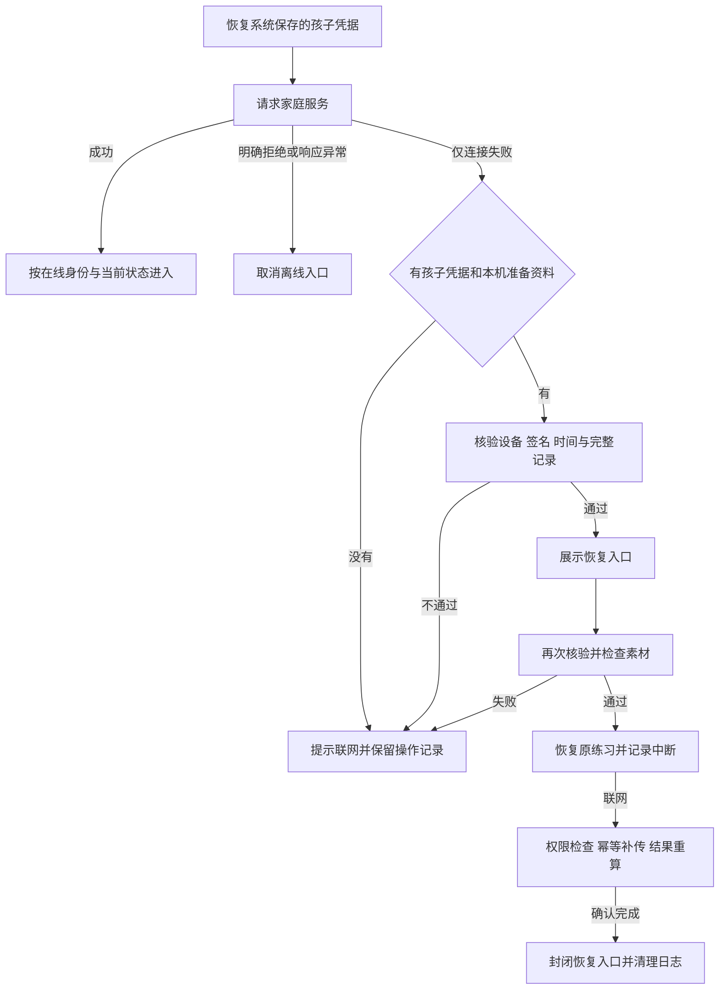

# 原生已准备练习的断网恢复

平台版本 0.11.0，2026 年 9 月 30 日。本文面向移动、后端、安全和测试团队，说明已接通的恢复流程、记录边界及设备验收方法。全球 6–17 岁家庭的产品范围不变；这一批仍使用本地服务和未审核的开发内容。

## 本批解决的问题

此前原生端缓存了素材和操作记录，但重新打开后必须从服务端重新取得计划、授权和内容声明。v0.11 将在线核验后的最小恢复资料存入同一加密数据库：网络不可用时，原安装可以重新核验这些资料，并恢复原练习。

离线只开放这一份已经准备好的练习。家长资料、生活目标、创建新练习和重新取得授权仍需要联网。本文记录 v0.11 原生实现；v0.12 的 Web 重开与缓存边界另见 [Web 断网重开](WEB-OFFLINE.md)。代码和模拟检查通过不等于设备断网、音频、加密文件和系统生命周期已验收。

## 家庭操作流程

1. 在线进入孩子练习，等待签名、当前状态、图片和适用的固定语音全部核验完成。
2. 页面提示本机恢复资料已保存。保存失败时明确提示保持联网，操作记录另行保留。
3. 断网并重新打开内置运行代码的原生测试包。请求超时上限为 12 秒；只有连接失败才尝试显示恢复入口。
4. 入口只显示练习名称和原授权截止时间，不展示家庭名称、孩子昵称、家长报告或成员列表。
5. 点击恢复后再次核验授权、记录和每份缓存素材。恢复时如果上一道题仍处于呈现状态，记为技术中断，不据此生成答错或反应时间。
6. 联网后按已有协议补传；服务器重新检查权限、内容召回和期限。只有收到完整结果确认后才移除本机日志和恢复入口。

孩子可以离开恢复入口，退出时取消本机离线访问资格。已有操作记录不会因为退出而被静默删除。家长后续可以在原设备重新登录处理旧记录。

## 准备资料和信任边界

| 资料 | 保存内容 | 保存位置 |
|---|---|---|
| 练习恢复资料 | 不透明家庭/孩子/安装标识、原计划、预算、原签名授权、内容发布声明及公钥 | 已有 SQLCipher 数据库的单个恢复槽位 |
| 操作记录 | 独立的有序事件；恢复资料只保存其 SHA-256 摘要 | 已有 `journal` 表 |
| 时间检查点 | 已观察到的最高时间、不可自动清除的时钟或授权故障 | 同一加密事务 |
| 素材 | 公共图片和固定 MP3，不含家庭资料 | 现有公共素材缓存目录 |
| 孩子凭据与数据库密钥 | 不写入恢复资料、素材目录或日志 | 系统安全存储 |

恢复资料严格限定字段，不保存账号密码、访问令牌、CSRF、昵称和重复的事件副本。它包含不透明的关联标识，仍按家庭数据管理。

签名只说明资料来自本地开发签发者；保存公钥不是正式生产信任根。所有声明限制为 `local-development` / `LOCAL`。本批没有弱化 `APP_MODE=production` 的拒绝启动门槛。

## 恢复状态机

HTTP 401、403、409、500、JSON 解析失败和代码异常均不当作连接失败。服务明确拒绝已有访问时，同时取消内存中的孩子身份、尝试清除安全存储的孩子凭据，并清理或封闭对应离线入口。存储失败要显示待处理状态，不能声称资料已清理。

## 不可绕过的检查

### 授权和内容

- 安装标识、平台、孩子、练习、完整计划摘要、预算和 native 传输方式必须匹配原签名。
- 内容声明必须匹配计划的任务、年龄段、语言、引擎、策略和内容版本。另一份有效签名内容也不能替换当前计划。
- 记录期限仍取签发后最多 24 小时、家庭当天结束、内容期限中的最早值，重新打开不会延长。
- 服务器确认已经换设备的旧练习只可走在线历史恢复流程，不再准备离线新题。
- 缓存可能被操作系统清除。恢复时逐份核验大小与摘要，PNG 还需成功解码；缺一份就停止准备，不默默下载或使用错误替代图。

### 时间和记录

恢复前先检查上次保存的最高时间；回拨超过 1 秒或已有故障时不开放新题。容许的微小时间偏差也不降低已知最高时间。运行中使用墙钟与单调时钟，每次事件保存、每 30 秒、切入后台时保存检查点。

这能发现普通时间回拨，不能证明设备真实物理时间，不能防御被修改的系统或离线数据回滚。进程被强制结束可能丢失最近一次尚未提交的检查点；未完成实际设备验证前，不将其描述为可信时间证明。

操作记录必须与保存摘要一致、序号完整、事件结构有效、未超过授权的 3000 条事件上限，并能够由原计划完整回放。恢复资料不替代日志，也不制造缺失事件。事件和检查点同事务提交，模拟存储失败时两者一起回滚。

### 身份切换和晚到请求

`offline_generation` 保存本机准备代次。开始另一个练习、进入孩子身份、提交家长登录、原安装恢复或退出时，先改变代次并清除入口；晚到的旧准备任务不能写回来。

保存入口还必须匹配已落盘的日志内容和家庭/孩子所有者。已停止采集的档案或已封闭的会话不能通过晚到写入重新出现。单个槽位只服务当前准备的练习，不建立全家庭离线浏览列表。

收到结果确认、授权到期、换设备或其他明确拒绝时，封闭对应入口。`offline_closed` 目前保存最小会话标识以阻止复活；与已有档案阻止标记一样，其到期清理策略尚待实现，不能称为已完成保留期限管理。

## 同步与远端变更

设备离线时不能即时收到家长撤回、内容召回或另一设备交接。界面必须说明这一限制；联网后服务端检查优先于重复事件去重，旧授权不能覆盖撤回。

本机已经知道的停止状态须立即停止新输入。旧记录如仍允许补传，则按原授权的上传期限处理；上传期限不代表允许在期限内继续练习。超过补传窗口、缺失资料或设备密钥丢失时，使用已有家长恢复/导出/清理流程；本批没有增加七天自动清理。

## 工程入口

| 模块 | 责任 |
|---|---|
| `packages/session-runtime/offline-session.ts` | 最小恢复资料、签名/计划/日志/内容核验、明确连接错误类型 |
| `packages/session-runtime/offline-sql.ts` | 准备代次、所有者与事件快照条件、封闭标记、检查点 |
| `packages/session-runtime/authorization.ts` | 原授权、进程内时钟和持久化检查点 |
| `apps/family-mobile/src/storage.ts` | 同一带密钥连接、串行访问和原子提交 |
| `apps/family-mobile/src/client.ts` | 连接失败分类、身份变化前失效、明确拒绝后的凭据清理 |
| `apps/family-mobile/src/App.tsx` | 恢复入口及身份/响应代次检查 |
| `apps/family-mobile/src/Practice.tsx` | 二次核验、素材准备、日志恢复、运行时停止及补传 |

没有新增服务端接口或数据迁移，没有新增原生依赖。

## 设备验收清单

使用虚构家庭、内置运行代码的本地测试包和独立测试数据库；不要对现有用户记录做破坏性测试。

| 场景 | 通过条件 |
|---|---|
| 已准备后断网、强退、重开 | 不依赖 Metro；只恢复原计划；昵称和家长资料不展示 |
| 呈现期间强退 | 上一道题记为中断，未生成遗漏/答错，不恢复旧音频回调 |
| 断网前已上传但回执丢失 | 重传后只计一次；服务确认前保留本机记录 |
| 过期、回拨、缺少素材或事件 | 阻止新题；提供联网恢复；没有假完成 |
| 家庭切换或家长登录时旧请求晚到 | 旧入口不能出现，新家庭数据不被覆盖 |
| 远端撤回后设备联网 | 停止新输入、清理相应档案，晚到写入不复活 |
| 远端换设备后原设备联网 | 停止课程资格，已有记录作为独立历史处理 |
| 数据库写入失败或安全存储不可用 | 停止输入，准确区分记录保留与清理未完成 |
| 系统清除缓存或重装 | 不假设素材、安装身份与密钥仍存在；缺失时需联网处理 |
| 完成并确认后再启动 | 不重新出现已确认的练习，不重复课程和额度结算 |

## 发布前仍需完成

移动与 QA 负责上述设备矩阵，安全负责人验证实际加密文件及清理失败路径。平台团队负责 Web 多浏览器离线验收、正式区域身份/信任体系和数据保留任务；内容团队负责全部语言和年龄组合的专业批准。方法团队与家庭研究团队仍需验证适龄性和现实生活中的效果。

检查记录见 [离线恢复验收](qa/offline-v0.11.md)，总体范围见 [产品方案](PRODUCT-PLAN.md)、[技术设计](TECHNICAL-DESIGN.md) 与 [执行计划](DELIVERY-PLAN.md)。
