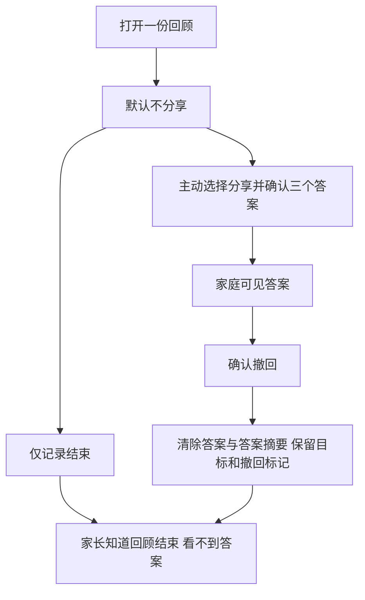

# 生活回顾的自主分享与撤回

平台 0.16.0 · 分享契约 reflection-sharing-1 · 2026-09-30。本文描述已经接通的本地 Web、原生页面及接口；全球身份、各地区法律政策和设备验收仍按总方案推进。

## 产品决定

家庭能够一起讨论目标，不意味着孩子的每个自评答案都应自动交给家长。四个年龄段现在都默认不分享生活回顾的答案；孩子每次可以重新选择，也可以跳过三个问题，只记录回顾结束。选择不分享不会影响课程、成绩、奖励或继续使用。

| 信息 | 家长能看到什么 | 系统保存什么 |
|---|---|---|
| 目标、帮助约定、回顾是否结束 | 家庭记录中可见 | 目标与状态记录 |
| 不分享的答案 | 不显示答案；显示回顾结束、答案未保存 | 不接收答案，也不保存答案摘要 |
| 明确分享的三个答案 | 记录与随后生成的导出中可见 | 结构化答案、明确分享动作 |
| 已撤回的答案 | 显示答案已移除；目标和结束状态保留 | 最小撤回标记，不保留答案或答案派生摘要 |
| 旧版本已经可见的答案 | 标明旧版本中已向家庭显示 | 保留原记录，允许撤回；不伪造新同意 |

不分享的选择只存在当前页面内存，离开或完成回顾后清除，不提供私人日记恢复功能。正在操作的同一台设备仍能看见选择；家长创建的孩子作用域不证明真实操作者身份，不能承诺对同设备家长绝对保密。

这个设计参考英国 ICO 对高隐私默认和适龄说明的要求，以及对家长监测透明度的说明；它是本产品的设计判断，不是全球法律适用结论。隐私选择本身不能替代法定同意与身份核验。[ICO 默认设置](https://ico.org.uk/for-organisations/uk-gdpr-guidance-and-resources/childrens-information/childrens-code-guidance-and-resources/age-appropriate-design-a-code-of-practice-for-online-services/7-default-settings/)、[ICO 家长控制](https://ico.org.uk/for-organisations/uk-gdpr-guidance-and-resources/childrens-information/childrens-code-guidance-and-resources/age-appropriate-design-a-code-of-practice-for-online-services/11-parental-controls/)

## 交互流程

1. 孩子选择或接受生活目标，约定帮助方式，离开屏幕尝试。
2. 回顾时回答三个可跳过的问题。每份回顾默认选择“不分享，只记回顾结束”，不继承上次分享选择。
3. 不分享时可以直接完成。明确分享时，必须完成三个结构化选择，并看见“家长可以在记录和导出中看到”的说明后提交。
4. 已分享记录提供撤回入口。确认说明包括：答案无法恢复、以前看过或另存的副本无法收回、目标和结束状态保留；可取消。
5. 家长页面使用家长视角说明，不允许家长作用域代填或开启分享。家长可以移除已有答案，但接口要求最近十分钟家长验证。

两端使用相同请求生成函数。中文与英文均已接入；生活目标仍是文字交互，没有为本功能声称新增固定语音。没有自由文本、录音、摄像或儿童聊天模型。



## 运行接口

沿用 [本地接口](LOCAL-API.md) 的身份、来源、CSRF、传输隔离及错误格式。读取 `GET /api/children/:id/life-goals` 必须含 `sharingPolicy: "reflection-sharing-1"`，每个目标返回 `reflectionSharing`。

`PATCH /api/children/:id/life-goals/:goalId` 均需 `Idempotency-Key` 和当前 `If-Match: "2"`。不同意保存答案的合法请求为：

```json
{"action":"reflect","sharing":"none"}
```

同时携带 `reflection` 被严格输入校验拒绝；客户端先剔除答案，再构建请求与重试指纹。明确分享为：

```json
{"action":"reflect","sharing":"family","reflection":{"outcome":"tried","helpful":"yes","next":"smaller"}}
```

撤回为 `{"action":"unshare"}`。它不会重新打开目标或把回顾改为失败。新分享只能在新的活动目标中产生，不能恢复已经撤回的旧答案。

| 状态 | reflection | 含义 |
|---|---|---|
| not-recorded | null | 尚未形成回顾 |
| not-stored | null | 已完成回顾，未保存答案 |
| family | 三个答案 | 当前契约下明确分享 |
| legacy-family | 三个答案 | 历史版本家庭已可见 |
| withdrawn | null | 已移除分享答案 |

旧客户端省略 `sharing` 时返回 `428 SHARING_CHOICE_REQUIRED`；新客户端遇到无分享契约的旧服务时清空页面数据并提示 `SHARING_UPDATE_REQUIRED`，不提交写入。版本冲突、已移除答案的旧重试、没有可移除答案分别返回 `GOAL_CONFLICT`、`REFLECTION_WITHDRAWN`、`REFLECTION_NOT_SHARED`。最近家长验证仍由服务端独立执行。

停止采集会撤销孩子凭据并禁止新增目标或回顾；已验证家长仍可撤回已有答案。这个例外只减少保存的信息，不重新开启采集或孩子访问。

## 数据与事务

迁移 15 位于 [reflection-schema.ts](../../apps/api/reflection-schema.ts)。新增 `life_goals.reflection_sharing` 和 `life_goal_actions.answers_removed`，更新状态约束。历史有答案的 reflected 行标为 legacy-family；没有答案的普通目标标为 not-recorded。迁移可重入，重跑不会把 withdrawn 改回已分享。

撤回事务按档案、目标顺序锁定并检查权限和版本，然后同时：

1. 移除目标行中的答案，分享状态改为 withdrawn，版本增加。
2. 重写该目标所有含 reflection 的历史动作载荷，只保留移除事实；清空答案派生的请求摘要，避免通过低熵答案组合反推内容。
3. 保留随机请求标识墓碑和 answers_removed 标记，使旧分享请求不能借幂等重试恢复答案。
4. 追加不含答案的撤回动作。任一步失败回滚整笔事务。

导出覆盖完整历史，包含可读分享状态与移除标记，不含内部请求标识或摘要。不分享及已撤回记录的导出均不含答案；已经下载的旧导出无法由本服务收回。生活回顾不加入任务评分、难度算法或周报比较。

## 多设备与兼容发布

生活目标只在联网时保存。读取响应为 no-store；页面挂载期间约每 15 秒刷新一次，并可手动刷新。读取失败清除陈旧列表；写入已确认但刷新失败时区分“已保存”和“最新状态未取得”。时间间隔受网络及平台调度影响，不承诺其他设备即时抹除已呈现内容。

本地升级顺序：迁移数据库并启用新 API → 更新 Web 运行文件及原生运行代码 → 验证旧客户端回顾被拒绝 → 检查历史标记、导出和撤回。不得通过给旧请求补上 sharing=family 来绕过明确选择。

原生应用版本仍为 0.2.0，本批导出 iOS/Android Hermes 运行代码，没有重新生成或安装 `.app` / `.apk`。旧内置运行包必须更新后才能使用新回顾契约。不能将服务降回不理解撤回标记的旧版本；正式发布还需要版本化静态资源保留、发布切换与灾备恢复过滤。

## 验证和未完成要求

见 [v0.16 验收](qa/reflection-sharing-v0.16.md)：自动检查覆盖四年龄段、缺失选择、权限、旧请求、并发、事务回滚、历史迁移、停止采集后的家长移除及跨传输重启。浏览器与接口证据分别记录，不能把接口测试写成原生设备验收。

下一阶段由现有团队承担：

| 负责人 | 下一项交付 | 通过条件 |
|---|---|---|
| 产品、儿童发展与体验研究 | 四年龄段对分享和撤回的理解测试 | 孩子能解释家长看到什么、哪些答案不会保存；允许拒绝，无诱导分享 |
| 身份与安全 | 独立青少年身份、家庭成员及逐成员权限 | 付款关系不自动扩权；邀请撤销、成年转换、监护争议有可执行流程 |
| 法务与地区负责人 | 首发市场权利、监护同意与保留规则 | 明确经营主体、数据区域、适用依据、访问争议及人工升级路径 |
| 平台 | 生产数据和副本处理 | 日志、缓存、对象、备份及恢复过滤均执行移除规则；不记录请求答案 |
| 移动端与测试 | iOS/Android 设备验收 | 大字体、读屏、离开后台、身份切换、弱网和撤回后刷新有实证 |

以上未完成部分继续属于原始产品目标。本批不构成完整全球青少年权限系统、专业内容批准或训练效果证明。
