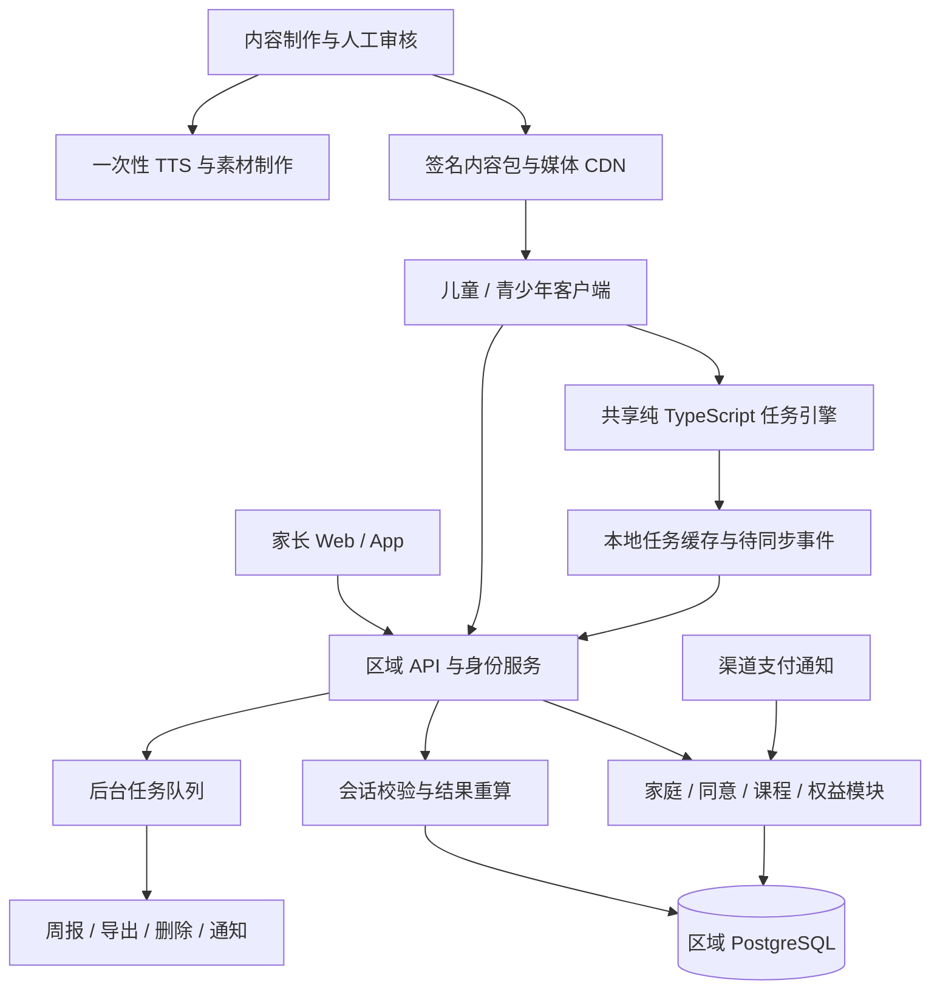
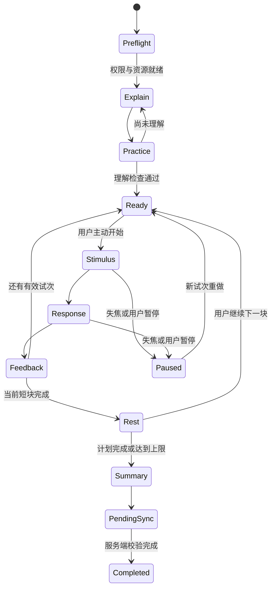

# 技术设计：任务引擎、家庭平台与内容系统

> 实施补充（v0.28）：四年龄段、两语言、四任务的 32 个内容组合已生成固定语音台词与缺口清单；6 个已接入、26 个尚缺。正式 `published` 内容缺 MP3 或音色 ID 会被拒绝，字幕一致性沿用现有内容模型。283 项业务和 14 项 HTTP 检查通过，原生测试包已更新，真实听审与设备音频仍未完成。见 [缺口清单](qa/content-readiness-v0.28.md) 和 [验收](qa/content-readiness-v0.28-qa.md)。

> 实施补充（v0.29）：原生播放器无法加载已验证声音时，保留文字说明并允许继续；安全存储读取失败时进入封闭重试页。iOS 模拟器启动诊断确认当前测试包缺 Keychain 权限（`-34018`），身份与声音设备流程不能验收；后续需要具备相应权限的开发签名。见 [本批验收](qa/audio-fallback-v0.29-qa.md)。

> 实施补充（v0.27）：两端生活目标接通稳定历史分页、当前目标单列、旧页撤回答案及后台读取代次保护；旧接口保留、schema 仍为 25。282 项业务和 14 项 HTTP 检查通过，独立 PostgreSQL 本批因 Docker 环境未启动。设计见 [家庭生活目标](FAMILY-LIFE.md)，安装包与准确验收范围见 [本批记录](qa/life-history-v0.27.md)。

> 实施补充（v0.26）：两端家长记录接通稳定翻页、微秒精度和局部失败提示，Web 按需加载记录区；schema 保持 25。实现与边界见 [家庭历史设计](FAMILY-HISTORY.md)，功能证据见 [本批验收](qa/history-v0.26.md)。两平台安装包及 iOS 安装核验已补交，原生 UI 仍待验收，见 [原生交付](qa/native-package-v0.26.md)。

> 实施补充（v0.25）：家庭 Web 新增小屏四入口导航、完整菜单及键盘焦点管理；schema 仍为 25，无新依赖。本批构建和浏览器交互检查通过，完整套件及原生安装包证据仍属 v0.24。见 [小屏交互设计](COMPACT-FAMILY.md) 与 [验收记录](qa/compact-family-v0.25.md)。

> 实施补充（v0.24）：家长课与生活任务接通按年龄的双语版本、方法/中文/英文三项独立审阅、签名发布、召回与历史版本保留；迁移至 schema 25。264 项业务、12 项 HTTP、15 项 PostgreSQL 检查通过。见 [家庭内容发布设计](FAMILY-CONTENT.md) 与 [当前验收](qa/family-content-v0.24.md)。真实专业审阅、正式身份与监护同意、原生真机及家庭研究仍未完成。

设计基线 1.0 / 2026-09-30。技术选型是建议，不表示相关依赖已安装或服务已运行。详细依赖版本在启动实施时锁定到通过安全检查的稳定版本。

## 1. 现有代码评估与迁移

本节记录设计起点的原生 JavaScript + 静态 Node 原型；动态实现进度以 [实施账本](IMPLEMENTATION.md) 为准。原型不能直接接入付费后上线。核查覆盖 `src/core.js`、`src/app.js`、音频清单、服务端脚本与现有测试。

| 当前资产/问题 | 事实 | 迁移决策 | 验收 |
|---|---|---|---|
| 三个任务核心规则 | 纯函数与页面逻辑已有初步分离 | 将规则迁入纯 TypeScript 引擎，保留旧样例作对照 | 相同输入得相同事件与结果 |
| 难度判断 | 三级；最近两次合格记录达到 85% 升级，搜索/记忆每次仅 3 轮 | 按任务、条件和有效样本窗口调整 | 三轮全对不能触发正式算法升级 |
| 课程安排 | 用自然年周数模 4 | 建立个人 enrollment，按实际单元完成推进 | 跨年、漏练、跨时区不跳课 |
| 本地数据 | localStorage 单使用者，最多各 100 条记录 | 保留成人可导出；新平台提供显式迁移 | 不自动把旧记录分给某个孩子 |
| 统计展示 | 历史任务记录可混合不同条件 | 按协议、难度、提示、设备模式分组 | 不混成一个能力总分 |
| 顺序语音 | 「听一遍顺序」播放泛化指令，没有读本次物品序列 | 语音词表与序列事件绑定 | 每个随机序列的播放顺序与字幕一致 |
| 过桥纠错语音 | 漏点兔子也可能播放狐狸等待提示 | 按错误类型使用独立素材 | 四类结果逐项核对文字与声音 |
| 音频生命周期 | 播放失败、取消与忙碌状态缺少统一控制 | 独立播放器状态机和取消令牌 | 暂停/换页/失败不会残留禁用按钮或串音 |
| 16 段 Azure MP3 | 只覆盖一部分固定流程，用户已认可中文音色 | 保留音色基线，建立完整覆盖清单 | 每个年龄、语言、状态都有批准文案与回退路径 |
| 方法说明 | 部分页面残留实时语音/模型的旧说明 | 文案与架构单一来源 | 页面描述与运行时网络请求相符 |
| 图片与精灵 | 已有生成图片，但尚无正式资产质量门槛 | 做成统一资产包，重新检查识别、裁切、体积、授权来源 | 小屏、低性能设备、色觉差异测试通过 |
| 静态服务 | 本机绑定、无业务 API、无身份与健康检查 | 原型留作演示；另建生产平台 | 禁止把演示服务直接当公网后端 |

设计起点的 20 项自动测试和语法检查通过；未覆盖生产权限、真实浏览器所有交互、全球适龄性或效果。迁移不得将旧数据伪装成使用新协议采集的基线。

## 2. 总体架构与选型

### 2.1 系统结构



建议 **模块化单体后端 + 独立异步工作进程**。同一业务代码库内划分清楚权限与事务边界；数据规模或团队边界证明需要后再拆服务。无需第一天搭建复杂微服务平台。

| 层 | 建议 | 原因与边界 |
|---|---|---|
| Web | React + TypeScript，家长端与浏览器训练端 | 支持响应式布局、可访问性和快速评审；保持语义化 DOM |
| 移动端 | React Native，共享协议、算法、数据模型 | 原生音频、缓存和商店支付；不假设 Web 与原生计时完全一致 |
| 引擎 | 纯 TypeScript，无 UI、网络和系统时钟依赖 | 随机种子、时钟和输入可注入，便于回放 |
| 服务端 | Node.js LTS + TypeScript；Fastify 或团队现有受支持框架 | 启动时确定一种，核心领域不依赖框架 |
| 数据 | 托管 PostgreSQL + 对象存储 | 事务、关系约束、区域备份；对象存储负责媒体/临时导出 |
| 队列 | 初期数据库任务队列，满足负载后再引入托管队列/Redis | 支付、报告与删除任务均幂等 |
| 内容管理 | 结构化表单、预览、差异审核、签名发布 | 管理员 MFA，编辑与批准分权 |
| 可观测性 | 第一方指标、结构化脱敏日志、必要崩溃报告 | 默认不记录孩子文本、请求正文、屏幕回放或广告标识 |

儿童版与青少年版可以共享仓库、任务引擎和家庭权益，但 UI、内容包与商店声明独立验证。第一阶段浏览器完成协议验证，原生团队同步建设壳层与设备测试；不得等到全部 Web 完成才研究原生音频和计时差异。

### 2.2 推荐目录

```text
apps/family-web/           家长与网页练习
apps/kids-mobile/          儿童体验
apps/teen-mobile/          青少年体验
apps/api/                  区域业务 API
apps/worker/               报告、同步处理、删除、通知
apps/content-admin/        编辑、审核、发布
packages/task-engine/      状态机、生成器、评分
packages/contracts/        API、事件和内容模式
packages/policy/           年龄、地区、权限策略
packages/content/          审核后的版本化元数据
packages/audio/            平台播放器接口与素材索引
packages/design-tokens/    字体、颜色、间距与动效约束
infra/                     区域部署、监控、备份
research/                  独立受控分析代码，不含原始受试者资料
```

### 2.3 地区与数据边界

至少规划美国、欧洲、中国大陆三类区域部署能力；英国是否采用欧洲区域，由具体供应商与跨境安排决定。此为降低复杂度与风险的设计选择，不宣称 GDPR 普遍要求全部本地化。

全球公共层仅分发公开内容包、翻译与版本信息。家庭身份、同意、训练、账单映射、客服工单和备份留在批准区域；地域路由用最小化的不透明标识，仍按可能关联个人的信息管理。认证供应商和监控也必须纳入区域数据流，不能只把数据库放在当地就称作数据不出境。

客户端改变语言不迁移区域。跨区域迁移是重新取得必要同意、核对接收方与权限、加密导出导入、验证与清理的独立工作流，首版可由支持团队人工执行。中国大陆采用独立配置、密钥、域名与供应商链路，商业开放依赖分类审查。

## 3. 任务引擎与计时

### 3.1 状态机



所有状态都允许退出到 Aborted；受权限撤回、内容召回或数据删除影响时进入 Revoked。Aborted 保留有效的已完成块，Revoked 不继续上传训练事件。计时任务不可通过关闭退出按钮强行完成。

### 3.2 计时与有效性规则

- 使用单调时钟记录试次内相对时间；服务端时间用于接收与账务，不替代客户端反应时。墙上时钟仅作课程日期参考。
- 页面布局和素材就绪后，在确认绘制的时点记录视觉 onset；听觉任务在音频实际播放回调记录 onset。音频资源下载开始不能算刺激出现。
- 屏幕刷新、触控输入、蓝牙音频延迟、设备负载都会影响测量；设备模式与渲染/音频异常随试次记录。不得宣传毫秒级临床精度或直接跨设备比较。
- 前后台切换、系统打断、资源失败、明显帧异常时，将该试次标记 `interrupted` 或 `technical_invalid`；不作为漏反应，不进入难度计算。
- 同一试次仅接受协议允许的输入；重复点击按原始输入保留并由评分器处理，不能简单在客户端丢弃后声称没有冲动误触。
- 练习、正式练习、固定测量分别标记 `mode`。提示后形成 `assisted` 试次，允许继续，不混入首次独立表现。
- 正式测量固定时序、种子策略与参数，训练自适应不可修改测量协议。

随机算法与种子版本固定；服务端发放计划种子及内容版本，可重建目标序列。客户端事件记录呈现结果、输入与异常，服务端重算得分。此机制能发现程序错误或不一致，**不能证明实际操作人就是孩子，也不能阻止所有客户端伪造**。

### 3.3 首个协议实现的参数起点

以下值是供科学负责人评审与仿真的草案，尚未验证适合全部年龄。每次默认一个核心任务、两个短块，年龄化示范与生活活动另计；可在额度内组合任务，但不能为了凑算法样本数延长当天练习。

| 任务 | 入门短块 | 练习理解检查 | 第一维升级候选 |
|---|---|---|---|
| 搜索 | 4 个阵列，每阵列 6 项、1–2 个目标；自定提交；零目标轮需单独教过后开放 | 连续两个示例能找全且无误选；提示后再试 | 阵列由 6 到 9 项，暂不改相似度或加倒计时 |
| 抑制 | 12 次，8 Go/4 No-Go；最长同类连串 3；入门窗口 3.6 秒、间隔 1 秒 | 对 Go 和 No-Go 各成功两次，错误类型独立解释 | 先增加材料变化；加速必须采用单独审核的下一参数档 |
| 顺序记忆 | 4 个序列，每个 2 项，不重复；先自定编码；物品词表先确认理解 | 两个不同顺序能独立复现 | 长度 2 到 3 项；编码方式和延迟保持不变 |
| 持续留意 | 12 次短呈现，4 目标/8 非目标；每次 3 秒、间隔 1 秒；不超过 48 秒 | 先分别示范目标变化与无变化，再完成一个 4 次练习块 | 增加少量呈现次数，目标/非目标比例和反应窗口保持 |

日额度以 enrollment 的家庭时区和孩子为单位，由服务端原子保留，设备租约携带剩余额度；本地单调时钟累计并落盘，重开、换设备或更改系统时间不直接补回额度。时区变更设冷却并保留当天已消耗量；系统应允许家长降低额度。边界遇到无时限题目时先停止新刺激，提供结束/保存，不突然用失败音截断。

## 4. 自适应难度：保守、可解释、可复现

### 4.1 先分开计算不同结果

| 任务 | 主要指标 | 禁止的简化 |
|---|---|---|
| 搜索 | 命中率 = 命中/目标数；误选率 = 误选/非目标数；整轮准确率 | 不把点击次数多视为积极表现；零分母返回空值 |
| Go/No-Go | 命中率与正确等待率；平衡准确率 = 两者平均 | 不以总正确率让「一直等待」获得高评价 |
| 顺序记忆 | 完整序列正确率；位置匹配率；是否辅助 | 不将二项与五项序列、视觉与听觉混合 |
| 持续留意 | 目标命中、非目标误报、按段表现、有效时长 | 不能从十几次短任务估计临床持续注意水平 |

反应时仅汇总有效正确反应的中位数和分布，需同时展示正确性；极短反应标记是否为提前输入，阈值按协议预定。小样本不输出 d′、年龄百分位或伪精确能力值。

### 4.2 首版策略 v1 的完整规则

1. 先通过理解检查和设备检查。初始参数取该年龄/协议的保守起点，适配需要可进一步降低，不依据诊断标签推断难度。
2. 每块结束后选取**当前协议、模态、设备类别和相同难度**下的有效独立数据；最多回看最近 14 天 3 次会话。中断或辅助块不作为失败，但不能被跳过后持续选择远期好成绩。
3. 最低样本：搜索 12 个完整阵列、且至少 24 个目标机会；记忆 20 个完整序列；抑制至少 40 个 Go 和 20 个 No-Go；持续留意至少 20 个目标和 40 个非目标。均需覆盖至少两次会话；不要求在一次练习内凑够。
4. 升级须满足：主要成功率 ≥85%，关键错误率 ≤10%，且主要成功率的 80% Wilson 区间下界 ≥70%；双类别任务分别检查两类，不只看均值。阈值与置信水平是产品假设，需仿真和试用校准，不是心理测量常模。
5. 降级：同条件有效独立块连续两块主要成功率 <60%，或者孩子主动选「简单一点」。用户求助立即生效，无需等待样本量。升级证据不足时保持，不能因不升级提醒孩子「落后」。
6. 连续 3 个明确错误时先暂停并解释，不直接推断疲劳或注意缺陷。孩子自报累/不想继续时停止，系统不凭反应时给情绪标签。
7. 每次只改一个维度，且最多一步；升级最多每个任务每次会话一次。视觉复杂度、序列长度与时间窗口不能同时变化。
8. 换设备、改模态、规则更新或阈值变更，建立新的可比序列；新版本需要桥接验证，不能把差异画成能力变化。

```text
decideNext(block, history, policy):
  if childRequestsStop or hardLimitReached: return STOP
  if childRequestsHelp: return EASIER_OR_DEMO
  if comprehensionUncertain or repeatedErrors: return EXPLAIN
  window = comparableIndependentWindow(history, block, policy)
  if twoLowValidBlocks(window): return LOWER_ONE_DIMENSION
  if not enoughEvidence(window): return HOLD
  if upgradeConditions(window) and not upgradedThisSession:
      return RAISE_ONE_DIMENSION
  return HOLD
```

每次保存输入窗口摘要、策略版本、决定和原因码，例如 `HOLD_INSUFFICIENT_NO_GO`。家长可见「继续巩固等待规则」，无需展示统计术语；研究和审计可回放决定。早期不使用黑箱强化学习或大模型决定难度。

实现约定：Wilson 下界使用双侧 80% 区间，z=1.281551566，p=k/n，计算 `(p + z²/(2n) - z·sqrt(p(1-p)/n + z²/(4n²))) / (1 + z²/n)`；n=0 返回空值。这里的区间只衡量所选试次比例的不确定性，试次间并非完全独立，不能把它解释为心理能力的置信区间。仿真同时检查这种简化造成的升级偏差。

## 5. 数据模型与权限

### 5.1 核心实体

所有个人记录包含区域、创建时间、版本和必要的删除状态；UUID 不能替代权限控制。

| 实体 | 关键字段 | 约束 |
|---|---|---|
| Guardian | id, region, auth_subject, verified_status | 成人身份与儿童训练身份分开 |
| Family | id, region, billing_owner_id | 付款权不自动授予全部数据权 |
| Membership | family_id, guardian_id, role, child_scope, revoked_at | 邀请需验证、到期、单次接受；撤销立即生效 |
| ChildProfile | id, family_id, alias, birth_month/year, age_policy, locale | 不要求实名；若年龄边界需精确确认，单独完成，默认采用更严格策略 |
| ConsentReceipt | purpose, legal_basis, policy_version, verifier_ref, granted/withdrawn_at | 记录谁对什么目的确认；不留存验证证件副本 |
| SharingPolicy | child_id, viewer_id, field_scope, version | 按年龄、当地权利和家庭选择共同约束 |
| Enrollment | child_id, curriculum_version, started_at, unit, timezone | 按个人进度，不按自然年周次 |
| Session | child_id, pack_version, policy_version, seed, mode, lease, state | 单个孩子同时仅一个计入计划的会话 |
| Trial/Event | session_id, trial_id, event_id, seq, monotonic_ms, type, payload | 唯一事件 ID、会话内唯一序号、严格类型与大小限制 |
| BlockResult | session_id, scorer_version, denominators, validity, provenance | 服务端计算；结果可追溯重算 |
| TransferObservation | child_id, goal_id, context_enum, reminder_count, reporter | 初期结构化记录，不收集学校名、教师姓名或日记 |
| Entitlement | family_id, channel, product, state, valid_until, revision | 由验证后的交易更新，孩子不能自行提交付费成功 |
| ContentRelease | pack_id/version, sha256, reviewer_ids, status | 已发布版本不可原地修改 |
| DeletionJob | scope, processors, steps, retry, completed_at | 删除覆盖副本、队列、导出和恢复流程 |

研究数据使用独立身份映射与访问域，研究同意独立记录；去掉姓名后仍可能关联个人，不能直接称为匿名数据。

### 5.2 权限矩阵

| 身份 | 训练 | 看家庭摘要 | 原始数据/导出 | 付款 | 管理同意/成员 |
|---|---|---|---|---|---|
| 儿童会话 | 仅本人、已获准任务 | 适龄本人结果 | 通过适龄权利流程 | 无 | 无 |
| 青少年 | 本人 | 本人及共享设置范围 | 按当地权利与验证流程 | 无 | 可表达意愿；法定权利独立处理 |
| 经验证监护人 | 发放授权 | 仅授权儿童范围 | 需重新验证及权利检查 | 仅有账务角色者 | 依法有权且权限明确者 |
| 受邀照护人 | 协助被授权孩子 | 最小共享范围 | 默认无 | 默认无 | 无权提升自己 |
| 客服 | 无 | 默认无；申请临时授权 | 无批量导出 | 仅必要账务状态 | 特殊事项双人审批 |
| 内容编辑/研究员 | 无家庭访问 | 无 | 仅独立批准研究范围 | 无 | 无 |

家长区入口的算术题或长按只能防误触，不能代替身份认证或可验证监护同意。支付、导出、邀请、撤销同意和查看敏感信息需服务器验证的成人会话与必要重新认证。

Web 用 Secure/HttpOnly/SameSite cookie 与 CSRF 防护；原生令牌放系统安全存储。儿童模式使用绑定特定 child_id、权限和期限的令牌，不保留成人高权限会话。数据库 RLS 作第二道隔离，应用连接角色不能是表所有者或 BYPASSRLS；使用事务内设置上下文并测试连接池复用。[PostgreSQL 行级安全](https://www.postgresql.org/docs/current/ddl-rowsecurity.html)

核心 OpenAPI 草案展示原生端的儿童 Bearer 凭据。Web 由同源会话网关把 HttpOnly 儿童会话映射到相同的内部作用域，不能为了复用示例把成人令牌搬到 localStorage。平台提供的年龄范围与监护信号纳入政策适配器，在支持地区减少生日采集；这些信号不自动替代所有处理目的的合法依据或监护同意。[Apple 适龄体验接口说明](https://developer.apple.com/kids/)

## 6. API、离线与同步

核心机器可读草案见 [OpenAPI](contracts/openapi.yaml)。以下规则对 Web 与原生一致。

### 6.1 会话事务

1. 创建会话：验证地区/年龄/同意/成员关系/权益/内容发布状态，用 `Idempotency-Key` 请求。服务端返回 session_id、计划种子、冻结的版本、离线授权到期时间与事件限制。
2. 本地逐事件落盘，再向界面显示「已在此设备保存」。建议每完成试次写一次事务；事件上传可按块或最多 100 条/256 KiB 批量发送。
3. 同步事件：服务端先验权，再校验版本、类型、会话归属和序号；重复 ID 且规范化内容一致返回已接收；同 ID 不同内容返回冲突，禁止覆盖。
4. 结束提交：客户端提交最后序号 `last_seq` 和完成原因。服务端确认 1..last_seq 连续、必需事件完整后重算；缺失返回 409 和范围，客户端补传后重试。明确零事件放弃的请求独立处理。
5. 结果页本地可以先展示标注为「待同步」的结果；只有服务端确认的版本进入跨设备周报。结束重复提交得到同一结果，不二次累计。

`seq` 是传输完整性依据，不是可信墙上时间。服务端接受乱序到达但不接受重复序号不同事件；不允许客户端直接上传「得分 95」作为事实。删除/撤销检查优先于幂等重放，旧请求不能复活已删除档案。

### 6.2 离线授权与冲突

- 下载的公共训练内容可长期缓存，私人事件放 IndexedDB/原生加密存储；缓存可能被系统清理，应明确尚未同步的数据风险。[浏览器存储配额与清理](https://developer.mozilla.org/en-US/docs/Web/API/Storage_API/Storage_quotas_and_eviction_criteria)
- 首版仅允许已在线授权的会话在限定窗口离线继续，授权最长 24 小时且受预计时长约束；无有效授权时可进入不记录个人数据的公共示范，不自行创建计入课程的新会话。
- 离线令牌不含姓名等资料，签名并绑定档案、设备、版本和范围。离线无法即时感知撤销，界面如实说明；联网先检查撤销/删除，再处理 outbox。不得承诺能即时擦除永不联网的设备。
- 为避免两台设备重复推进，一名孩子只允许一个有效训练租约；第二台可只读进度或确认接管，接管会使旧会话失去计入计划资格。旧设备数据仅在仍有合法处理依据时进入带来源的练习记录，不合并伪装成连续一次。
- 自适应状态、课程单元采用服务器版本号与 compare-and-swap；过期客户端不能覆盖新决定。用户目标、共享范围更新用 If-Match，冲突时显示两份选择，由成人/有权用户确认。
- Service Worker 仅缓存公开静态资源，不缓存私人 API 响应；退出家庭、切换档案、成员撤销和删除时清理对应本地命名空间。活跃试次中不强行升级 Service Worker。
- 超过 7 天的未同步事件按已告知策略清理；到期前提醒家长设备有未同步记录。失去同意后的事件不继续收集；必要的删除状态查询与用户权利处理须有独立合法依据。

### 6.3 其他业务接口边界

| 接口族 | 关键行为 |
|---|---|
| `/families`, `/memberships`, `/children` | 成人权限、地区与版本检查；禁止 ID 越权 |
| `/consents`, `/sharing-policies` | 目的独立、证据版本化、撤回实时失效 |
| `/plans`, `/content-releases` | 仅下发已批准年龄/语言/地区组合 |
| `/observations`, `/reports` | 报告由确定规则生成，显示分母与缺失 |
| `/exports`, `/deletions` | 成人/主体权利验证、异步处理、下载短期有效 |
| `/billing/webhooks` | 签名验证、事件去重、订单校验、退款与恢复 |

所有 API 统一错误码、request_id、速率限制、输入长度和结构校验。错误日志不写入令牌、密钥、原始儿童文本或支付凭据。租户信息来自验证后的会话与关系查询，不能相信请求头自报的 family_id。

## 7. 内容、图片与语音生产线

### 7.1 内容发布

流程：任务协议 → 文案 → 适龄/跨文化审稿 → 素材制作 → 自动检查 → 人工试听/试玩 → 双人批准 → 签名不可变包 → 灰度 → 监控与召回。

内容包含 task_version、policy_version、locale、年龄范围、刺激定义、随机化、参数上下限、字幕、音频映射、生活活动、资源校验值与审核记录。发布人不能同时是唯一批准人。示例见 [内容包草案](contracts/content-pack.example.json)。

客户端只解释受限数据，不从内容包执行 JavaScript。策略参数超界、签名不符、依赖不兼容或未批准区域时拒绝加载。会话锁定包版本；正常更新在下一会话生效，安全召回则暂停并解释。

### 7.2 语音

延续 `zh-CN-XiaoxiaoNeural` 作为中文候选主音色，保留现有用户认可的试听样本作参考。语音生成在受控制作环境一次完成；运行时只播放素材。生产工具的密钥保存在密钥管理服务，浏览器、Git、构建产物和日志不包含密钥；既往在聊天或其他非密钥系统出现的凭据应进入轮换清单。

不把孩子姓名、表现、家长自由文本传给 TTS。英语及其他语言选音色后由母语审稿人试听，不把翻译文本批量生成成功当成可用。云 TTS 只发送固定文案，供应商合同与其他业务数据流仍需单独评估。[Azure 文本转语音接口](https://learn.microsoft.com/zh-cn/azure/ai-services/speech-service/rest-text-to-speech)

每条素材记录 text_id、规范文本、voice、locale、SSML 版本、生成工具版本、文件 hash、时长、响度、授权来源、审核人。字幕与声音共用一条文案源，不各自手写。

顺序任务先制作完整词表，以稳定停顿拼接已审核物品名；如拼接效果不自然，按受限任务空间离线生成完整序列音频，不能运行时调云服务。较长序列需限制组合空间并记录词汇熟悉度；儿童不知道图案名称时先教学或更换词表。

播放器仅有一个活动通道，支持 prepare/play/stop/replay/fail 状态，使用 generation token 丢弃过期回调。点击重播、换页、暂停时同步清理队列与 busy；播放失败只触发一次回退。听觉测量模式播放失败即标无效；普通引导可用字幕继续。系统 TTS 仅作家长明确选择的便利功能，声音来源与可能联网情况需说明，不作为正式测量的默认回退。

质量门槛：无削波与明显底噪、句首句尾不裁断、各段音量稳定、词序与字幕 100% 对应；响度初始目标 -18 LUFS 左右、真峰值 ≤-1 dBTP 是工程制作假设，短语还需实际设备试听。不同语言不要强行同一语速；验证儿童理解和听觉舒适度。

### 7.3 图片与本地化

图像资产必须有源文件、授权与生成记录、尺寸、透明区域、锚点、碰撞区、缩略图和低带宽版本。训练刺激优先保证边缘清晰、亮度/大小可控，装饰性的精致程度不能使目标比干扰物天然更显眼。

四套年龄内容至少各有一套完整示范、正式刺激与生活活动。英语和中文使用 ICU 消息、复数/长度测试、字体覆盖；RTL 布局预留但未审稿前不宣称支持。刺激左右顺序在 RTL 语言下是否镜像，属于协议决定，不能由 CSS 自动改变。

媒体预算假设：首屏压缩资源 ≤1.5 MB，首个离线训练包 ≤20 MB，后续按需下载；以真实中低端 Android/iPad、弱网、静音、蓝牙与大字号检查。下载进度和重试清楚可见。

## 8. 隐私、安全与数据生命周期

### 8.1 最小采集

不默认采集精确位置、摄像头、麦克风、广告 ID、学校或诊断资料。年龄以满足适龄与法律判断所需的最小信息收集；生日临界需要确认时使用专门流程。诊断等研究资料放独立受控系统，不作为商业推荐标签。

可验证监护同意是目的与法域相关的业务流程，不能只用勾选框。优先使用适用的验证供应商，保存方法、交易引用与结果，避免自己储存身份证件。营销同意、研究同意与提供核心服务所需处理分别管理，不以拒绝营销阻止孩子练习。

### 8.2 留存设计初稿

| 数据 | 初始留存建议 | 删除与验证 |
|---|---|---|
| 原始训练事件 | 90 天；按目的必要性复核 | 汇总后定期清理，研究另有独立同意与期限 |
| 家庭训练摘要与生活记录 | 默认滚动 12 个月，家长可提前删除 | 删除不能只隐藏图表，需清除关联数据 |
| 本地未同步队列 | 最长 7 天，失去处理资格立即停止上传并清理 | 断网设备下次启动/联网执行，并说明技术限制 |
| 临时导出 | 7 天后删除，下载链接最长 15 分钟有效 | 下载须验证请求者，存储禁止公开访问 |
| 备份 | 初始滚动 35 天 | 恢复时先重放删除清单，不复活已删除档案 |
| 账务/同意/安全审计 | 按地区法定义务与证明必要性另设期限 | 与训练库分离，仅保留最少字段，不借此无限保存训练数据 |

上述期限是产品设计建议，最终由目的、法规与研究方案决定。常规删除服务目标 30 天内完成，适用法定时限优先；备份清理周期和例外提前告知。拒绝无限期保存用于「将来可能训练 AI」。

删除事务：冻结新写入 → 撤销令牌/会话/共享链接 → 建立最小删除标记 → 清理数据库、对象、队列、缓存、报表及供应商副本 → 标记备份到期与恢复过滤 → 生成可审计结果。删除标记也要限定字段与保留目的。

### 8.3 重点威胁与测试

| 威胁 | 控制 | 必测场景 |
|---|---|---|
| 家庭 A 访问 B 的孩子 | 服务端关系校验、RLS、对象级授权 | 改 URL ID、批量事件、报告导出、缓存复用 |
| 儿童进入成人敏感操作 | 短权限会话、重新认证、不可由前端标记提权 | 修改本地状态、回退导航、浏览器共享设备 |
| 撤回后离线补传 | 先验撤销/删除，再验幂等 | 旧令牌、重复事件、恢复备份、旧客户端 |
| 支付伪造/重复/退款竞态 | 验签、渠道查询、事务去重、权益版本 | 重放通知、乱序退款、订阅恢复 |
| 内容供应链污染 | 编辑批准分权、模式校验、签名、依赖扫描 | 改音频 hash、越界难度、未知脚本字段 |
| 内部人员过度访问 | 最小权限、临时授权、审计、定期复核 | 客服搜索、批量下载、生产数据库权限 |

完整威胁建模和外部渗透测试属于发布门槛。安全告警由指定值班人员分级响应；涉及个人信息事件按影响法域的通知义务处理，不能用统一 72 小时概括所有国家规则。

## 9. 支付与权益

以家庭为权益主体，采用渠道适配器支持 Web、App Store、Google Play 及批准市场的支付渠道。客户端支付回执需服务端验证，回调按 provider_event_id 去重，状态机处理 active、grace、expired、refunded。取消自动续费不等于已付周期立即失效；退款和账务调整以渠道与当地规则为准。

允许网络故障时在签名权益宽限窗口内完成已授权练习，绝不因支付通知延迟中断正在进行的一题。付款入口、价格、续费与取消都在成人区。不得把某一家支付渠道的费率或全球覆盖写死为商业前提。

## 10. 运维、容量与质量门槛

### 10.1 初期容量假设

假设 10,000 周活跃孩子，每周 3 次、每次 100 个事件，即每周 300 万事件。按每事件 1 KB 粗算约 3 GB 原始载荷/周，尚未计索引、复制和备份。10,000 次各 20 MB 的首次包下载约 200 GB。该估算用于容量压测与成本模型，不是用户增长预测。

初期验证 500 并发练习、事件批量上传峰值与报告任务同时运行；根据实际每试次事件数重算容量。游戏运行不依赖逐次网络往返，CDN 故障和 API 故障分别降级。

### 10.2 候选 SLO

| 指标 | 首发目标 | 测量口径 |
|---|---|---|
| 区域核心 API 可用性 | 月度 ≥99.9% | 有效请求成功率，排除可解释的权限/输入拒绝 |
| 会话无严重技术中断 | ≥99.5% | 已开始且合法授权会话；按设备/版本分组 |
| 已确认事件完整性 | 正常重试/进程故障验收中零丢失、零重复计分；生产发现丢失立即响应 | 比对确认回执与持久化；未发送数据与区域灾难 RPO 单独报告 |
| 普通区域 API 延迟 | P95 <300 ms | 约定区域服务端请求路径，不含用户公网 RTT/异步导出 |
| 已缓存任务启动 | P95 <2 秒 | 参考设备和固定资源包，实际测量 |
| 恢复目标 | RPO ≤15 分钟，RTO ≤4 小时 | 实际恢复演练验证后才能对外承诺 |

### 10.3 测试分层

- 规则：判分、分母为零、随机序列约束、策略边界、版本兼容，用确定样例和性质测试。
- 状态：任何状态暂停/退出/重播不串音；后台恢复不制造漏反应；无有效试次不显示 100%。
- 同步：重复、乱序、缺失、冲突、断网、设备接管、撤回后补传、删除后重试，验证最终只有一份结果。
- 权限：跨家庭、跨孩子、照护人越权、成人会话泄漏、导出链接转发、连接池 RLS 上下文残留。
- 内容：音文一致、词表顺序、资源 hash、任务参数边界、年龄/语言缺口与未批准版本拒绝。
- 浏览器与设备：iOS/Android/Web 中低端设备、触控/键盘、弱网、低存储、大字号、色觉/听力适配；明确支持列表。
- 发布：数据库迁移回滚、支付乱序、备份恢复、删除演练、签名包召回、研究版本冻结。

### 10.4 发布与回滚

内部成人 → 指定家庭 → 某一市场/年龄/语言的小比例 → 扩大。远程开关只能控制已编译能力和经过模式校验的参数。每个版本有 kill switch，能停止特定内容/地区的新会话而保留导出、取消与删除功能。

数据库采用先兼容旧读写再清理的迁移方式。客户端至少支持约定的前两版内容契约；太旧时提供清楚升级路径，不能丢弃未同步数据。研究队列固定内容和策略；安全修复单独记录偏离协议，不在研究中静默改变难度。

## 11. 主要架构决定与取舍

| 决定 | 获得什么 | 承担什么 |
|---|---|---|
| 纯任务引擎共享，多端渲染独立 | 规则一致、可回放 | 原生/Web 仍需各自测计时、声音与可访问性 |
| 服务端重算结果 | 减少统计错误、便于审计 | 增加协议与版本管理，不等于防作弊认证 |
| 区域化模块单体 | 权限、事务与运维更可控 | 多区域发布与数据迁移需要专门流程 |
| 固定素材与规则化报告 | 内容可审核、低延迟、可离线 | 新语言与反馈文案需要内容制作投入 |
| 分年龄共享机制 | 青少年体验更可信 | 监护关系、地区规则与客服复杂度增加 |
| 先规则自适应 | 原因可解释、样本要求明确 | 暂时不能宣称自动找到每个孩子最优训练 |

下一步不是一次重写全部旧项目：先用一个任务完成「内容包 → 客户端 → 事件 → 服务端结果 → 家长报告」的纵向闭环，再推广到四类任务和各端。
