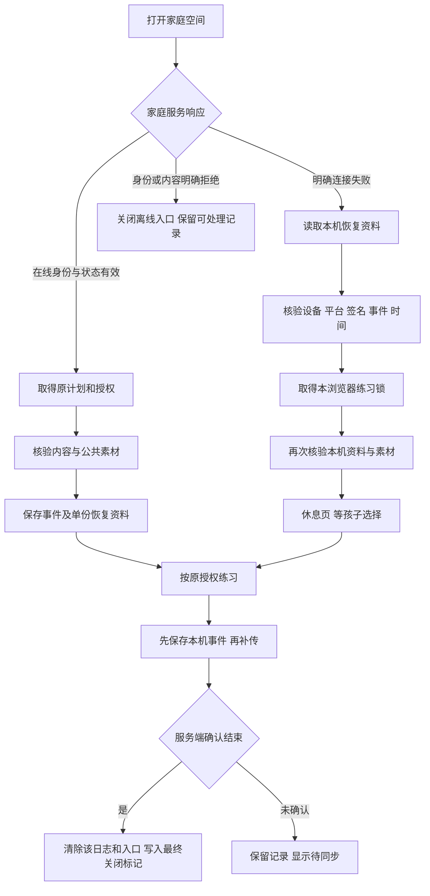

# Web 断网重开与记录恢复

平台版本 0.12.0 · 2026-09-30。面向前端、平台、安全与测试团队。全球家庭、6–17 岁分龄设计和完整商业发布要求保持不变；本批仍为本地开发模式。

## 交付行为

在线打开一份签名练习，核验素材并保存网页运行文件后，界面明确提示“已保存此浏览器的恢复资料”。家庭服务不可连接时，同一浏览器、同一地址可以关闭页面后重新打开，恢复原练习。进行中的题重新开始，已有有效步骤保留；恢复不会另建课程或延长原授权。

离线入口只显示任务与原截止时间，不显示家长资料、孩子昵称或其他档案。恢复后先暂停，由孩子选择继续或结束。离线结束保留待确认记录；联网点击重试后，服务端重算并确认，随后清除对应本机日志与恢复入口。新课程、家长功能与生活目标仍需联网。

**适用入口：**构建后的 `http://127.0.0.1:4181/`。`4180` 是 Vite 开发入口，不注册离线网页服务。不同协议、主机或端口是不同存储来源，不能换一个地址期待读到原恢复记录。开发时也不要在这些入口同时切换家庭：同主机 Cookie 可能跨端口共享，而 IndexedDB、缓存和设备标识按来源分开。

```sh
npm run build
npm start
```

若 `npm run dev` 已在运行，家庭服务会同时提供 `dist/web-releases` 当前指针指向的版本，无需再启动占用 4181 的第二个服务。首次准备必须联网；页面更新后可能需要关闭本站所有旧标签页再重新打开。

## 三类保存内容

| 位置 | 保存内容 | 不保存的内容与限制 |
|---|---|---|
| `focus-public-shell-<摘要>` | 构建清单指定的首页、入口脚本、样式和静态图片 | 不拦截 `/api`、写请求、查询参数、跨来源或任意路由；不缓存家长接口响应 |
| `focus-public-content-v1` | 经过内容签名和逐文件摘要检查的公共任务图片、固定音频 | 不缓存家庭报告；每次恢复重新检查大小和摘要，不信任“文件曾下载过” |
| IndexedDB `focus-family-journal` v3 | 事件、事件摘要、单份最小恢复资料、时间检查点、身份代次、关闭/阻止标记 | 不保存密码、Bearer、家长账号响应或重复事件副本；属于浏览器存储，并非 SQLCipher 加密数据库 |

`focus-ui-locale` 只记录 `zh-CN` / `en` 界面偏好；没有保存偏好时按浏览器语言选择。语言不会因服务断开或恢复资料清除而突然回到默认中文。原设备 UUID 保存在既有来源的本地存储中，不作为用户身份凭据。

网页缓存可能被用户或浏览器清理。缺少必要资料时停止恢复，不伪造完成状态，不创建新授权。原始事件在退出离线入口或身份代次变化时保留，供后续授权恢复；完整确认、主动清除缓存、档案停止采集/删除另有清理路径。

### 家长导出本浏览器日志

家长在已验证的档案中导出记录时，先取得家庭服务授权的档案数据，再附上**当前浏览器、当前孩子**仍保留的本机事件日志。文件中的 `localRecovery` 明确标记来源、导出时间和 `included` / `none` / `unavailable` 状态；其他设备或浏览器的日志不在这个文件中。成功补传并清除的日志，以及已过七天本机保留期限的日志，也不会重新出现。

导出会重新计算本机事件摘要；摘要不符或浏览器存储不可用时，仍可下载服务端记录，但会在界面明确提示本机日志未包含，并将状态写为 `unavailable`。旧版无摘要的日志标记为 `legacy-unverified`，不能被误认为已核验。家长若需其他设备的待补传记录，须在该设备、原浏览器地址登录后单独导出。

网页与原生使用同一导出序列化检查：档案 ID、版本与必需记录数组须匹配，任意层出现凭据或内部设备／请求标识时拒绝生成文件。当前单次 JSON 导出限制为一千万字符；超限会明确报错、保留原资料，不生成可能不完整的文件。正式长期大档案仍需设计可恢复的分批导出。

## 完整流程



只有包装为 `NetworkUnavailable` 的网络连接失败可触发离线候选。401/403、召回、解析异常、普通代码错误都不因“请求没有成功”而自动降级。浏览器写请求重开后先取得当前 CSRF 信息；凭据拒绝仍按拒绝处理。

### 身份、竞态与重复页面

- 正常情况下，登录、退出、切换儿童、创建/恢复/交接会话，以及停止采集/删除前，提升本机身份代次并清除单份入口。旧异步保存必须匹配代次，否则事务失败。
- 浏览器存储损坏时，家长登录、退出、停止采集和删除仍会发送到家庭服务；界面提示本机清理未确认，并暂停新的儿童练习。家长可重试本机存储；重试只核验存储和当前家庭状态，不主动抹掉尚未同步的恢复记录。儿童进入、开始练习与设备交接仍要求本机日志可用，不因家长资料权利的降级通道而放行。
- `navigator.locks` 保证同来源只有一个实际练习写入者。第二个页面可以看到恢复入口，但进入时被阻止，按钮停用并说明应先关闭另一页。浏览器关闭进程会释放锁；正常退出等待已经接受的写入完成后释放。
- 设备 UUID 首次准备也使用单独锁，避免多个新标签页各自生成标识。缺少练习锁能力时停止启动并提示重连/重试，不默许多页同时写日志。
- 家庭身份变更通过 `BroadcastChannel` 通知其他页面。消息包含当前页面来源标识，发起页面忽略自己的通知；其他页面立即收起旧家长画面、旧报告和练习，再读新作用域。
- 最终关闭标记不可被较晚的非最终关闭覆盖。仅过期或停止新题的非最终关闭，仍允许诚实的结束事件和历史记录补传；不能重新准备离线续练入口。

## 原子记录与迁移

v1 的 `sessions` 对象仓库原位保留，v2 增加 `offline`、`meta`、`blocked`、`closed`。旧日志没有家庭字段时，只能在核对原孩子 ID 后由当前授权流程补齐，错误所有者被拒绝。旧页面阻止数据库升级时，关闭新连接并提示，不能删除旧库强制重建。

事件摘要先在事务外计算；事务内同步发起读取，并在请求回调中完成条件检查与写入，避免加密异步调用使 IndexedDB 事务失活。事件、摘要及恢复检查点同一事务提交：模拟配额写入失败时三者一起回滚。最高已知时间只能升高，故障不能通过重复准备清除。

完整事件仍要通过共享的 `verifyOfflineSession` 核验，不单凭摘要判断合法性。该函数区分 Web/native 授权传输，验证完整计划、设备、签名、内容绑定、事件序列、原截止和时间异常。这里的时间检查不能证明真实物理时间，也不能即时收到断网期间的家长远端撤回。

## 网页运行文件的安装与更新

`scripts/build-offline-shell.mjs` 遍历 Vite 的入口静态依赖图，为每个文件生成长度和 SHA-256 清单，输出 `focus-sw.js` 与 `offline-shell.json`。运行器只接受根首页及明确的公共资产路径；路径穿越、私有 API、外部地址、带查询的地址在生成时被拒绝。

v0.16 更新验收发现：原位覆盖构建可能删除旧页面仍引用的懒加载文件，普通刷新可能继续使用旧运行文件。错误边界已补充关闭本站所有标签页后联网重开的说明，实际恢复成功且已保存记录保留。此处理不等于无缝更新；正式部署必须保留旧版本静态资源并原子切换发布。未强制跳过等待或接管活动练习，详见 [v0.16 记录](qa/reflection-sharing-v0.16.md)。

v0.17 已用独立构建和不可变版本目录解决本机原位覆盖问题：切换当前指针时保留旧页面的动态资源，已实测旧页面发布后首次进入生活目标并保存成功。正式 CDN、旧资源保留期限、紧急撤回与跨服务回滚仍待完成。见 [网页发布设计](WEB-RELEASE.md) 和 [本轮验收](qa/web-release-v0.17.md)。

安装逐文件限制下载大小并核对摘要；任何失败删除新版本缓存，保留旧版本。更新不调用 `skipWaiting` / `clients.claim`，不在孩子练习中替换控制器。旧页面全部关闭后，新版本才按浏览器生命周期激活；激活只清理本产品旧的网页运行文件，不清理练习素材与日志。默认更新生命周期与安全上下文限制见 [MDN Service Worker 指南](https://developer.mozilla.org/en-US/docs/Web/API/Service_Worker_API/Using_Service_Workers)。

“可离线重开”还需要当前入口属于活动版本，清单内文件全部存在，任务素材全部缓存成功，并且原授权仍有效。不满足时只说明本页面可以暂时离线继续，不承诺关闭后可以恢复。家庭生活目标、恢复管理等动态页面不纳入首屏离线包；正式部署必须保留仍被旧页面引用的不可变动态文件。

事务与跨页锁的实现依据分别见 [MDN IndexedDB 事务](https://developer.mozilla.org/en-US/docs/Web/API/IDBTransaction)、[MDN Web Locks](https://developer.mozilla.org/en-US/docs/Web/API/Web_Locks_API)。本批并未取得所有浏览器的兼容性结论。

## 验收范围和后续门槛

已用独立虚构家庭在 Codex 内置浏览器操作：中文 6–8 岁、英文 15–17 岁搜索练习；服务进程停止时关闭/重开、实际续练、离线结束重开、重新联网补传、第二页拒绝、跨页家长画面收起与完成后入口清除。此方法证明家庭服务不可达时恢复，不代表操作系统飞行模式、浏览器进程强退或移动系统缓存驱逐均通过。

自动检查覆盖 v1 迁移、跨连接身份竞态、撤回后的晚到写入、最终关闭、旧快照与时钟故障、事务回滚，以及实际生成的网页运行脚本在模拟作用域中的公共缓存边界。记录、截图及构建摘要见 [v0.12 验收](qa/web-offline-v0.12.md)。

仍需：Safari/Firefox/移动浏览器与原生设备矩阵；真实配额不足/缓存驱逐；生产 CDN 旧文件保留、清理和跨服务回滚；公共素材缓存与关闭标记的保留期限；生产固定信任根、区域身份与撤回传播；新图片和完整语音的适龄审核、真实家庭研究。原生 v0.11 `.app` / `.apk` 未在本批重新编译或完成设备验收；本批只重新导出共享代码的 iOS/Android 运行包。
