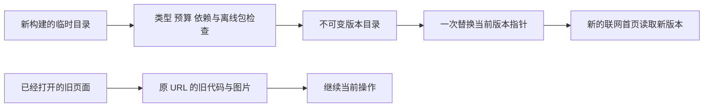

# 家庭网页的版本发布与旧页面连续使用

平台 0.17.0 · 更新 2026-10-01。本批解决家庭 Web 的静态文件更新问题：新版本发布后，已经打开的旧页面仍能读取它原先引用的代码和图片。工作台、原生安装包、数据库和内容包有各自的发布边界，不由这套机制自动切换。

## 为什么要改变构建方式

v0.16 验收发现，直接在正在服务的目录执行构建，会删除旧页面尚未加载的代码。例如家长打开首页后部署了新版本，再首次点击“生活小目标”，旧页面请求的旧文件已经不存在。页面刷新又可能被离线缓存带回旧版，形成重复报错。Vite 官方文档也说明了旧哈希资源被部署删除后发生动态导入失败的情形。[Vite 构建与加载错误](https://vite.dev/guide/build#load-error-handling)

现在先在独立目录构建、验证全部文件，再原子替换当前版本指针。旧文件按原 URL 保留，不以强制刷新或强行激活新 Service Worker 来打断页面。



## 实际构建与目录

日常仍运行 `npm run build`。它先做类型检查和工作台构建，再调用 `scripts/build-web.mjs`：

1. 创建当前构建专属的临时目录，Vite 不再清空正在服务的目录。
2. 检查家庭首页静态依赖预算，生成带摘要的离线运行文件。
3. 核对完整 Vite 清单，包括尚未打开的动态页面及其图片、样式；检查所有依赖存在。
4. 核对首页引用、预算明细/总数、离线文件大小/摘要，以及生成的 Service Worker 是否与清单一致。
5. 写入不可变版本目录，再以同目录 rename 一次替换 `current.json`。文件先同步写入；本轮没有取得断电或所有文件系统持久性的验收结论。
6. 删除该次构建自己的临时目录；保留过去已发布版本。

```text
dist/web-releases/
  current.json                    当前版本和旧资源路由；不通过 HTTP 公开
  releases/<内容摘要>/
    manifest.json                 版本、文件长度和 SHA-256
    files/index.html
    files/focus-sw.js
    files/offline-shell.json
    files/budget.json
    files/assets/...
    files/.vite/manifest.json     构建依据；不通过 HTTP 公开
```

首次正常构建发现旧 `dist/web` 时，先完整校验并收录该目录，保留旧页面引用。旧目录本身不覆盖、不删除。没有现存构建的新安装直接发布新版本。直接运行 Vite 只得到 `dist/web-candidate` 候选，不改变线上指针；不要把它当作已发布版本。

隔离验收可以使用 `node scripts/build-web.mjs --store <隔离目录>`；此模式不自动导入主开发环境的旧构建。启动服务时用同一目录设置 `FOCUS_WEB_RELEASE_DIR`。正常服务默认读取 `dist/web-releases`。构建输出会返回当前摘要、实际目录、保留版本数和字节数。

## 读请求和访问边界

家庭服务每次读取当前指针。首页、运行脚本和元信息使用同一版本目录中的文件；旧哈希资源通过指针里的保留路由定位到原版本。单次请求不会读到半份指针。跨多个请求可能跨过发布点，但引用的不可变资源仍保留，因此不要求浏览器恰好同时请求所有文件。

| 请求 | 行为 |
|---|---|
| `/`、`/index.html` | 当前版本，no-store |
| `/focus-sw.js`、`/offline-shell.json`、`/budget.json` | 当前版本，no-store |
| `/assets/<受限文件名>` | 已发布路由中的不可变文件，可长期缓存 |
| `/.vite/…`、`/current.json`、`/releases/…`、隐藏文件及未登记资源 | 404，不直接暴露整个构建目录 |
| 公共网页的非 GET/HEAD 请求 | 405 |
| 活动版本的元数据或字节损坏 | 503，保留家长数据，不默默退回另一份代码 |

响应保留 CSP、nosniff 和既有安全头，增加公开的 `X-Focus-Web-Release` 摘要供排查。每次从磁盘读取文件会核对长度与 SHA-256；没有把此单机实现声称为全球 CDN 性能方案。原有 `/api`、`/media`、`/content-assets` 处理边界保持独立。

尚未进入托管发布模式的安装可兼容读取经验证的旧目录。进程已经读取托管版本后，如果当前指针缺失则拒绝静态读取，不以旧目录作为静默回退。

## 失败与并发处理

| 情况 | 结果 |
|---|---|
| 缺文件、伪造预算、离线包或首页不一致 | 发布前失败，当前内容继续使用 |
| 同一公共资源名对应不同字节 | 拒绝发布，防止污染旧页面缓存 |
| 两个发布者同时工作 | 目录锁只允许一个提交；另一方得到忙碌或过期错误 |
| 较早开始的构建在新版本之后完成 | 对比构建开始时的当前摘要，拒绝过期提交，不把版本意外退回 |
| 写完不可变目录后进程停止、尚未切换指针 | 仍读取旧版本；同一候选重试会先核对遗留文件，再使用它们 |
| 到达保留上限 | 拒绝新增发布，保留现有服务，不删除仍可能被引用的旧文件 |

默认最多保留 128 个已登记版本、累计 512 MiB 文件长度；单个候选最多 512 个文件、64 MiB，每个文件最多 16 MiB，指针最多 8 MiB。累计数按版本计算，包括重复文件，不是操作系统整个目录的磁盘配额。异常退出留下的未登记目录、文件系统开销与其他构建目录不计入该数，需要运营清理规程。

没有自动清除旧版本、自动倒退、远程管理入口或删除 API。异常退出留下发布锁时，先检查锁内进程标识对应的实际进程和正在运行的构建，再由维护人员解除；不凭锁文件年龄假定工作已经停止。达到容量上限前应按正式保留策略扩容或实施经过演练的清理，而非直接删除旧哈希目录。

## 页面什么时候切换版本

已打开的页面可以继续使用原代码。新 Service Worker 仍按浏览器生命周期等待旧页面关闭，不调用 skipWaiting 或 clients.claim。浏览器离线缓存可能让新开的标签页暂时仍处于旧版；待新版本下载完成、本站旧页面全部关闭后再进入，才切换到新代码。

家长家庭页面增加“网页版本”，便于说明问题发生在哪个版本。它与原生应用版本 0.2.0 分开表示。本批没有改变练习、回顾的权限契约，也没有放松 v0.16 对明确分享选择的要求；旧 API 或旧数据库能否与某次新 UI 兼容，仍须逐版本验收。

## 已验证和剩余要求

新增 10 项自动检查和 1 项真实进程 HTTP 检查，完整回归 208 项自动检查、8 项 HTTP 检查通过。真实浏览器从 v0.16 首页保持打开，在发布 v0.17 后首次进入旧生活目标模块并成功保存；关闭重开后显示 0.17.0，登录和目标仍保留。详见 [本轮验收](qa/web-release-v0.17.md)。

仍需完成：

- 活动练习进行到一半时的版本切换、多浏览器、弱网与存储驱逐矩阵；本轮页面保存验收不等于所有计时场景通过。
- 生产发布身份、制品签名、可审计审批、区域 CDN 与多实例协调。
- 明确旧资源支持期限、紧急安全撤回与清理策略、容量监测和真正的恢复演练。
- 数据库、API 和客户端兼容窗口，以及明确的回滚流程；不能只回滚网页就假定数据仍兼容。
- 内容工作台自己的静态版本发布流程。当前改动针对家庭 Web，工作台仍保留独立构建方式。
- 原生 App 签名、商店更新与设备验收；本批没有重新打包原生应用，也没有新增外部账号或 API Key。

专业内容审核、真实家庭研究与全球上市门槛不因网页更新机制完成而改变。
